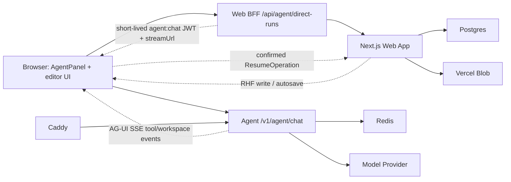
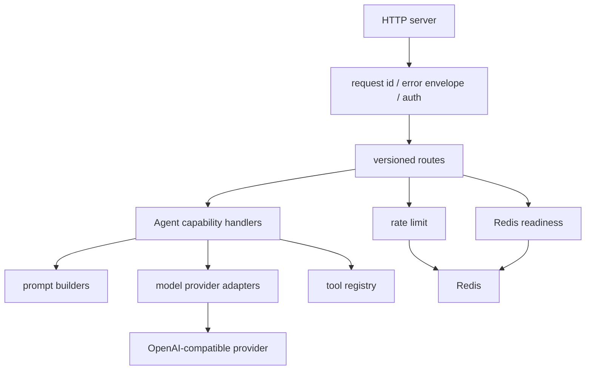
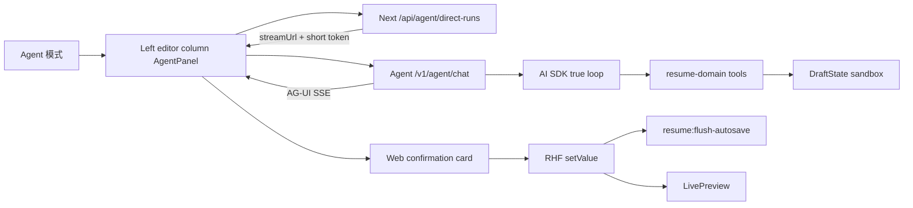

# Agent Microservice Architecture

## 一句话架构

intro-builder 的 Agent 能力采用 Web 主站 + 独立 Agent 微服务的双服务架构。Web 主站保留用户身份、编辑器状态和文档写入权；Agent 微服务只处理新增 Agent 能力的模型编排、长 loop、流式输出、工具调用与 Redis 支撑能力。

## 系统边界

## 服务职责

| 系统 | 负责 | 不负责 |
| --- | --- | --- |
| Browser | 用户交互、局部选择、取消请求、展示 streaming 状态、携短期 token 直连 Agent SSE | 保存最终真源、持有长期 provider key |
| Next.js Web App | auth、resume ownership 校验、短期 Agent JWT、React Hook Form、preview、autosave | 模型编排、长期 Agent memory、provider 直连 |
| Agent Microservice | prompt、model call、streaming、tool calling、Redis memory/rate limit、结构化错误 | 用户登录、resume DB 写入、编辑器状态 |
| Redis | rate limit、jti replay guard、短期 memory、后续 job/stream state | 永久简历内容真源 |
| Postgres | 用户、简历、模板、分享链接等主数据 | Agent 临时 memory |

## 当前服务构件

这些是当前 Agent 架构的基础构件；是否已上线以对应 PR、CI/CD 和 `deployment.md` 为准。

- `apps/agent` 是独立 pnpm workspace package，包含 Node/TypeScript HTTP 服务。
- `apps/agent/src/http.ts` 统一承载 `/health`、Redis-backed `/ready`、protected `/v1/session`、`/v1/rich-text/polish`、`/v1/resume/helpers/:helperId`、`/v1/agent/chat`、404/405、request id 和 JSON error envelope。
- `apps/agent/src/auth.ts` 校验短期 Agent JWT，并通过 Redis `jti` replay guard 防重放。
- `apps/agent/src/redis.ts`、`apps/agent/src/rate-limit.ts` 与 `apps/agent/src/ai-cache.ts` 提供 readiness、rate limit、AI 结果缓存和后续短期 memory 基础。
- `apps/agent/src/rich-text-polish.ts`、`apps/agent/src/resume-helpers.ts`、`apps/agent/src/agent-messages.ts` 分别承载 Phase 1、Phase 2A、Phase 3A 的新增 Agent 能力。
- `apps/agent/src/agent-tools.ts` 定义 Phase 3B 最小简历操作 tools 和 `ResumeOperation` 校验；这些 tools 只返回待确认操作，不写 Web 状态或 Postgres。
- `apps/agent/Dockerfile`、`apps/agent/compose.yaml`、`apps/agent/Caddyfile` 是服务器部署骨架。

## 内部模块形态

Agent 服务按以下模块组织；后续新增能力应该复用这些边界，不要把 provider 调用、auth 或 rate limit 分散进 UI/BFF：

## 调用形态

### 短请求

适合 health、ready、capabilities、session 验证、非生成型 metadata。

要求：

- Web 端统一通过 Agent client 调用。
- 允许有限 retry，只用于幂等 GET 或只读请求。
- 响应必须是 JSON。

### 生成请求

适合富文本润色、模块建议、聊天式 Agent panel。Phase 3B Agent panel 走 AG-UI `text/event-stream`，Web BFF 透传 Agent SSE body，assistant-ui 通过 `LocalRuntime` async generator 逐步渲染文本。

要求：

- 使用短期 JWT。
- 支持 AbortController 取消。
- 不做盲目 retry。
- 如果是 streaming，每个 chunk 必须有类型，不能让前端猜字符串语义。
- Web 端仍负责确认写回和 autosave。

### Agent Mode v2 请求

Agent panel 使用 Web BFF 控制面 + 浏览器直连 Agent 数据面。目标是稳定 lifecycle、assistant text、tool call/result、workspace checkpoint、`ResumeOperation` 和用户确认写回语义。

Rules:

- 右侧 `LivePreview` 在桌面 Agent Mode 中保持可见。
- assistant-ui 只负责 thread、composer、tool display，不拥有简历状态。
- 基础 tools 可以推理并生成待确认 `ResumeOperation`，但不能直接写 RHF 或 Postgres。
- 富文本 `resume_update_section` 必须保持 TipTap JSON 语义；列表不能被压成无结构段落。
- Internal loop tools 可包含 `resume_read`、`get_completeness`、`set_goal`、`resume_ask`、诊断工具和写 draft 工具。真实简历写回仍只能通过 visible `ResumeOperation` confirmation。

## 稳定性原则

1. `/health` 只代表进程存活，不依赖 Redis 或模型 provider。
2. `/ready` 代表服务可接业务流量，应检查 Redis 等关键依赖。
3. Agent 服务不可用时，Web 编辑器、preview、autosave 必须继续可用。
4. 模型 provider key 不进入浏览器，也不进入 Next.js client bundle。
5. 所有 Agent 请求必须带 request id，并在 Web 与 Agent 日志间贯通。
6. 生成类请求默认非幂等，失败后由用户显式重试。
7. Redis 只存临时状态和带 TTL 的 AI 结果缓存，不成为简历内容真源。
8. 旧 OCR、导入简历、AI 解析不穿过这个微服务，除非未来有单独迁移 plan。

## 香港 2C4G 部署约束

香港服务器资源较小，架构要主动限制常驻开销：

- Node 进程保持单服务优先，不一开始拆多个 worker。
- Redis 与 Agent 可同机部署，但需要限制日志体积和内存策略。
- Caddy 负责 TLS、gzip/zstd、反代和基础安全 header。
- Agent 进程必须有 readiness endpoint，方便未来加入 systemd、compose healthcheck 或外部监控。
- streaming 请求要限制最大并发、最大输入长度、最大输出时间。

## 不做的架构

- 不把 Agent 能力塞进 Next.js route handler 里长期运行。
- 不让浏览器直接持有 provider key。
- 不把 resume content 的最终写入权交给 Agent 服务。
- 不一开始引入复杂队列系统。
- 不为了单个富文本按钮引入 assistant-ui。
