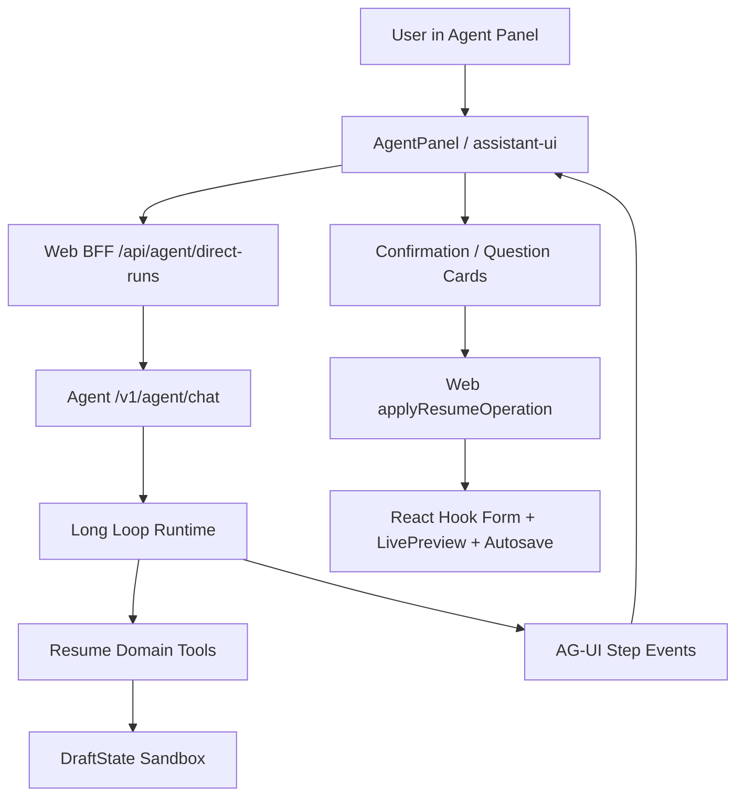

# 受 Fogot 启发的长 Loop Agent 方向

本文总结 Fogot agent panel 对 intro-builder 的启发，并给出当前缺陷、目标架构和优化路线。目标不是把 Fogot 的文件/命令/场景工具照搬进简历产品，而是在 intro-builder 里获得同样顺滑的专属 Agent 体验：长 loop、多轮 tool call、可观察的执行轨迹、可确认的写回，以及围绕简历领域设计的工具层。

## 结论

intro-builder 已经有正确的内核雏形：

- `apps/agent/src/workflows/loop-runtime.ts` 已经使用 AI SDK `streamText + tools + stopWhen(stepCountIs(...))` 跑真实多步 loop。
- `apps/agent/src/workflows/draft.ts` 已经把写入限制在 draft 沙盒里。
- `ResumeOperation` 和 `apps/web/lib/agent/apply-operation.ts` 已经形成确认写回边界。
- `apps/web/components/agent` 已经有 AG-UI 事件、工具卡、确认卡、问题卡和 assistant-ui 面板。

但它还没有完全形成 Fogot 那种 coding-agent 级别的流畅感。核心差距有四个：

1. 真实 loop 还没有成为唯一产品路径，旧 JSON provider 路径仍和新 loop 并存。
2. 工具调用没有按 step 实时流给前端，用户看到的更像“跑完后展示结果”，不是“正在连续执行工具”。
3. 工具层还偏简历字段修改，缺少诊断、自检、布局、可信度、岗位匹配等读/评估工具。
4. 文档、路由、工具 contract 已经漂移，后续实现者会误判当前信任边界和实际调用路径。

推荐方向：把 intro-builder 的 Agent Mode 收敛成一条主线。

```text
assistant-ui panel
  -> AG-UI run
  -> Web control plane validates auth and resume ownership
  -> Agent long loop
  -> resume-domain tools operate on draft
  -> step events stream back to Web
  -> user approves ResumeOperation
  -> Web apply dispatcher writes RHF and autosave
```

模型永远不直接写真简历。模型只操作 draft。draft 只产出 `ResumeOperation`。Web 只按 allowlist 确认应用。

## Fogot 给 intro-builder 的启发

Fogot 的 agent panel 好用，不是因为它手写了一个完整 coding-agent runtime。它的能力来自三层组合：

1. React/assistant-ui 负责聊天体验、线程、composer、消息 parts、tool card、reasoning、取消和分组。
2. AI SDK `ToolLoopAgent` 负责多步 agent loop，让模型可以连续调用工具并读取结果。
3. Godot/C++ 负责真实宿主能力，例如读写文件、改 scene、执行命令、接 debugger、走 undo manager。

这个心智模型可以直接映射到 intro-builder：

| Fogot | intro-builder 对应物 |
| --- | --- |
| assistant-ui chat dock | `AgentPanel` + assistant-ui/AG-UI runtime |
| `ToolLoopAgent` | `runResumeLoop()` / AI SDK `streamText + tools` |
| C++ Tool RPC | resume-domain tool layer |
| Godot undo manager | `ResumeOperation` + Web 确认写回 |
| 文件 diff / terminal tool UI | 简历 diff / draft preview / question card / risk card |
| scene live mutation | RHF content + LivePreview + autosave |

Fogot 最值得学的不是“给模型更多权限”，而是“让模型拥有足够多的领域工具，同时把真实写入留给宿主系统控制”。

## 当前架构事实

### 已经做对的部分

`runResumeLoop()` 已经具备多步工具循环：

- `LOOP_MAX_STEPS = 16`
- `streamTextImpl({ tools, stopWhen: stepCountIs(maxSteps) })`
- tools 由 `createLoopTools(draft, ...)` 提供
- 写工具只改 `DraftState`
- loop 结束后 `assembleLoopResult()` 输出标准 result

当前内部工具包括：

- `resume_read`
- `get_completeness`
- `set_goal`
- `resume_update_section`
- `resume_delete_section`
- `resume_reorder_sections`
- `resume_polish_text`
- `resume_set_text`
- `resume_ask`

当前安全边界也正确：

- Agent 不连接 Web 数据库。
- Web BFF 负责 Auth.js session 和 resume ownership。
- Agent JWT 默认 120 秒，上限 180 秒。
- Agent 侧要求 `agent:chat` scope。
- `DraftState` 里累积 operations，真实简历只在用户确认后由 Web 应用。

### 现在最影响体验的问题

#### 1. Tool 事件不是实时逐步流出

`runResumeLoop()` 已经支持 `onStepFinish`，但 `streamAgentLoopEvents()` 目前调用时没有传入 `onStepFinish`。结果是：

- 模型在服务端内部可能已经做了多轮 tool call。
- 前端不能实时看到“正在读取/正在润色/正在自检/正在追问”的每一步。
- `toStreamingRuntimeTailEvents()` 在 loop 结束后才把 tool/workspace/change-set 事件补出来。

这会让体验不像 Fogot/Codex/Cursor。真正的 coding-agent 感来自“我能看到它一步一步做事”，而不是“等一会儿后吐出一个建议包”。

#### 2. `resume_ask` 还不是硬中断

工具描述说 `resume_ask` 触发后 loop 停止，但当前实现只是把问题 append 到 `questions`。是否停止仍依赖模型之后不再继续调用工具。

这会带来两个问题：

- 缺事实时，模型可能问了问题后又继续起草，增加编造风险。
- 前端 interrupt 语义和实际 loop 控制不完全一致。

需要把 `resume_ask` 变成明确的 control-flow tool：一旦调用，立即结束本次 run，持久化 draft，返回 `input_required` interrupt。

#### 3. 新旧 Agent 路径并存

当前 `/v1/agent/chat` 里：

- AG-UI SSE 路径走新 loop。
- 非 SSE/fallback 路径仍走旧的 provider JSON parse。

这会导致同一个 endpoint 有两种 Agent 心智模型：

- 新模型：工具真实执行，draft 被工具修改。
- 旧模型：模型输出 JSON，再由服务端解析和归一化。

长期看，旧路径会拖慢 contract 收敛。它可以保留为 debug fallback，但不应该再是产品路径。

#### 4. 路由和文档漂移

文档里还大量写：

- Web: `/api/agent/runs`
- Agent: `/v1/agent/messages`
- “浏览器不直连 Agent”

当前代码实际是：

- Web control plane: `/api/agent/direct-runs`
- Agent data plane: `/v1/agent/chat`
- 浏览器拿短期 token 后直连 Agent stream URL

这不是错误。它是为了绕开长 SSE 代理时长限制的合理设计。但它必须被正式写成：

```text
Browser -> Web /api/agent/direct-runs
  Web validates user + resume ownership
  Web signs short agent:chat token
  Web returns streamUrl
Browser -> Agent /v1/agent/chat
  Agent validates token, scope, resumeId, jti replay guard, CORS origin allowlist
```

否则接手的人会以为当前实现违反了旧文档。

#### 5. 工具 taxonomy 没有分层

`packages/shared/src/types/agent.ts` 里的 `AgentToolName` 仍偏旧，只包含 UI 可见的五个基础工具。Agent 真实 loop 里已经有更多内部工具。

这需要明确分成两层：

- Internal loop tools：模型实际调用，包含读、诊断、润色、追问、自检。
- Visible operation tools：前端展示和确认写回时使用，围绕 `ResumeOperation`。

否则 shared type、Agent validator、tool card 和文档会继续互相拉扯。

#### 6. 工具能力还不够“专属简历 Agent”

现在工具主要围绕“字段读写”。这能完成修改，但还不够像一个专业简历顾问。长 loop 需要更多只读/评估工具，让模型先分析再动笔。

缺少的关键工具：

- `role_match_read`: 读取目标岗位和简历匹配缺口。
- `ats_check`: 检查 ATS 关键词、段落结构和可解析性。
- `content_claim_audit`: 检查疑似编造、无证据数字、过强表述。
- `layout_fit_check`: 检查内容是否会溢出页面或破坏版式。
- `template_fit_check`: 判断当前模板是否适合岗位/内容密度。
- `section_quality_score`: 对某 section 给出结构、可信度、具体性评分。
- `resume_preview_check`: 从当前 draft 生成预览级风险，而不是只看文本。

这些工具大多数应该只读，不写 draft。它们给长 loop 提供判断力。

## 目标体验

intro-builder 的 Agent Mode 应该让用户看到这样的过程：

1. 用户说：“帮我针对前端岗位优化这份简历。”
2. Agent 显示正在读取简历。
3. Agent 显示正在检查目标岗位匹配。
4. Agent 显示正在检查最近经历的 STAR 结构。
5. Agent 发现缺少结果指标，弹出问题卡：“这个项目最终提升了哪些指标？”
6. 用户回答。
7. Agent 恢复 draft，继续润色对应经历。
8. Agent 显示 diff 和风险标签。
9. 用户应用部分修改。
10. Web 写入 RHF，LivePreview 立即更新并 autosave。

这就是“长 loop + 多轮 tool call + 人在回路里”的产品流。

## 推荐目标架构



### 核心原则

1. Web 是产品状态权威。
   Auth、resume ownership、RHF、preview、autosave、template 都归 Web。

2. Agent 是推理和工具循环权威。
   Agent 可以读上下文、写 draft、运行诊断、自检、追问，但不写真实 resume。

3. `ResumeOperation` 是唯一 mutation boundary。
   所有真实改动必须变成 operation，走 Web allowlist dispatcher。

4. Tool event 必须实时可观察。
   每个 tool call 都应该有 start、args、result、status、error。

5. 长 loop 必须可恢复。
   每次 tool result 后都应保存 draft/workflow cursor。断线或追问后继续，不丢上下文。

## 具体优化方向

### 方向 1：把 true loop 定为唯一主路径

目标：

- 产品路径只走 `runResumeLoop()`。
- 旧 JSON provider parse 降级为 debug fallback 或删除。
- 所有 Agent Mode 请求都走同一套工具、draft 和 event contract。

建议改动：

- 在 `apps/agent/src/http.ts` 中明确 `/v1/agent/chat` 的 AG-UI SSE 是主路径。
- 非 SSE JSON fallback 不再用于产品 UI，只用于测试或调试。
- `docs/agent/service-contracts.md` 更新为 `/v1/agent/chat`。
- `docs/agent/README.md` 和 `architecture.md` 更新 control plane/data plane 描述。

验收：

- AgentPanel 只依赖 `/api/agent/direct-runs` + `/v1/agent/chat`。
- 文档不再把 `/api/agent/runs` 描述为当前路径。
- 新增 route contract test 覆盖 direct-runs bootstrap 和 chat stream。

### 方向 2：让 tool call 按 step 实时流出

目标：

- 用户能看到每一步工具调用，而不是等 loop 结束后一次性看到。
- Tool card 有 running、completed、failed 状态。
- 长 loop 期间 Web 可更新 workspace/draft preview。

建议改动：

- 在 `streamAgentLoopEvents()` 调用 `runResumeLoop()` 时传 `onStepFinish`。
- 在 `onStepFinish` 中立即发送 `TOOL_CALL_START`、`TOOL_CALL_ARGS`、`TOOL_CALL_RESULT`。
- 每个 step 后发送 `STATE_DELTA /workspace`，让前端可以展示最新 draft/change-set。
- 保留 loop 结束后的 final `RUN_FINISHED` 和 interrupt outcome。

需要注意：

- 现在 `runResumeLoop()` 的 `onStepFinish` 只能拿到 step 完成后的 toolCalls。要显示 running 状态，需要在 AI SDK 更早的 tool lifecycle 上挂钩，或者先接受 “step completed” 级别的工具卡。
- 如果短期只做 completed 工具卡，也要按 step 立即流出，不要等最后 tail events。

验收：

- 用户看到 tool cards 随 loop 推进逐个出现。
- 断开 stream 时，已完成的 tool event 已被 recorder/session store 保存。
- 单轮 8 到 20 个 tool call 时 UI 不闪烁、不重复、不丢 operation。

### 方向 3：把 `resume_ask` 改成硬中断

目标：

- 缺事实时停止起草，不让模型继续编。
- 用户回答后恢复同一个 draft 和 workflow cursor。

建议改动：

- `resume_ask.execute()` 设置一个 `draft.pendingAsk` 或抛出专用 `ResumeAskInterrupt`。
- `runResumeLoop()` 捕获该中断后立即返回 `{ questions, text, isAskPending: true }`。
- `streamAgentLoopEvents()` 持久化当前 draft 后发送 `RUN_FINISHED outcome.interrupt`。
- Web resume interrupt 时，把用户回答转换成新 user/system message，并带上 session snapshot。

验收：

- 模型调用 `resume_ask` 后，本次 loop 不再继续写 operation。
- 用户回答后，新 run 能读到上一轮 draft。
- eval 覆盖：缺目标岗位、缺公司名、缺结果指标时必须 ask，不得编造。

### 方向 4：建立专属简历工具层

目标：

让 Agent 不只是“改字段”，而是能像简历顾问一样先诊断、再自检、最后给出可确认修改。

建议新增工具分三组。

读工具：

- `resume_read`: 读取 draft 或上下文。
- `role_match_read`: 读取目标岗位、关键词、经验匹配缺口。
- `resume_preview_read`: 读取当前模板、页数、内容密度、可能溢出点。

评估工具：

- `get_completeness`: 完整度。
- `section_quality_score`: section 质量评分。
- `ats_check`: ATS 可读性和关键词覆盖。
- `content_claim_audit`: 事实可信度、疑似编造、无证据数字。
- `layout_fit_check`: 版式风险。

写工具：

- `resume_set_text`: 纯文本转 TipTap JSON 写 draft。
- `resume_polish_text`: 保结构润色。
- `resume_update_section`: 结构性替换。
- `resume_reorder_sections`: 重排。
- `resume_delete_section`: 高风险，默认必须确认。
- `resume_ask`: 硬中断追问。

工具原则：

- 优先增加读/评估工具，少增加写工具。
- 写工具只能写 draft。
- 写工具必须产生 `ResumeOperation`。
- 高风险工具必须设置 `riskFlags`。
- 不要增加泛用 shell/file/browser 工具。

### 方向 5：把 Agent UI 做成“工具轨迹”，不是聊天附属物

目标：

让用户理解 Agent 为什么这么改，并能对每个修改做决定。

建议 UI：

- Tool timeline：读取、诊断、润色、自检、追问逐步显示。
- Draft workspace card：显示当前草稿里被改动的 section。
- Operation card：显示 diff、riskFlags、应用/忽略。
- Question card：支持多问题批量回答。
- Review summary：最后总结已改、待确认、还缺事实。
- Auto-apply guard：低风险小改可以自动应用，高风险必须确认。

从 Fogot 学到的 UI 原则：

- 常规工具可以用 fallback card。
- 关键工具必须定制 UI，比如 diff、终端、计划、delegate。
- intro-builder 的关键工具 UI 应该是 diff、风险、问题、预览和 section 质量评分。

### 方向 6：长 loop 配置化

当前 `LOOP_MAX_STEPS = 16` 是一个固定常量。建议改成按模式/工作流配置：

| Workflow | 建议步数 | 说明 |
| --- | ---: | --- |
| `resume-diagnose` | 8-12 | 读、诊断、总结为主 |
| `experience-star` | 12-20 | 读经历、追问、润色、自检 |
| `target-role-match` | 16-24 | 需要岗位匹配和关键词检查 |
| `pre-export-check` | 10-16 | 格式、风险、最终检查 |
| `create-from-zero` | 24-40 | 需要多段起草、追问、补全和自检 |

配置来源：

- 默认 config：`AGENT_LOOP_MAX_STEPS`
- per workflow override：`workflowPolicy.maxSteps`
- per model override：根据 context window 和成本限制降级

验收：

- 长 loop 不靠硬编码。
- 每个 run 的 telemetry 记录 maxSteps、actualSteps、toolCallCount、finishReason。
- 达到 step limit 时，前端显示“已达到本轮上限，可继续让 Agent 接着做”，而不是像失败。

### 方向 7：持久化每个 step 的 draft checkpoint

长 loop 最大风险是中途断线或用户关闭页面。当前 recorder 记录 AG-UI event，但 draft 的关键变化应该在 step 级别可恢复。

建议：

- 每个写工具完成后生成 draft checkpoint。
- checkpoint 包含 draft snapshot、operations、toolCalls、workflow cursor、pending question。
- session store 以 threadId/sessionId 维度保存。
- 新 run 通过 `createInitialLoopDraft()` 恢复。

验收：

- stream 断开后，重新进入 AgentPanel 能看到已完成的 draft 进度。
- 用户回答问题后，不丢前面已起草 section。
- 拒绝某个 operation 后，后续 loop 知道用户拒绝了什么。

### 方向 8：补 eval 和 contract tests

长 loop 不能只靠手测。建议先补这些测试：

Agent loop eval：

- 缺目标岗位时必须 `resume_ask`。
- 缺结果指标时不得编造数字。
- STAR 润色保持列表结构。
- create-from-zero 不读已有 resume context。
- 达到 maxSteps 时返回可继续状态。

Tool contract tests：

- 所有 fieldPath 必须过 allowlist。
- `fieldPathToSection()` 不应该 unknown 默认 summary，应该返回错误。
- `resume_delete_section` 必须带 risk flag。
- `resume_polish_text` 不可用时要降级到明确错误。

UI/runtime tests：

- 每个 tool result 只渲染一次。
- operation 应用后状态从 waiting-confirmation 到 applied。
- question interrupt 可以恢复。
- auto-apply 不应用有风险的 operation。

Data plane tests：

- `/api/agent/direct-runs` 验证用户和 resume ownership。
- `/v1/agent/chat` 验证 JWT scope、resumeId、jti replay。
- CORS，也就是浏览器跨域访问控制，只允许配置的 Web origin。

## 分阶段路线图

### Phase 0：先修 contract 和文档

目标：让团队知道当前真实路径。

任务：

- 更新 `docs/agent/service-contracts.md`：`/v1/agent/chat` 成为当前 Agent chat route。
- 更新 `docs/agent/architecture.md`：写清 control plane + direct data plane。
- 更新 tool taxonomy：internal loop tools vs visible operation tools。
- 标记 `/api/agent/messages` 和旧 JSON provider 为 legacy/debug。

完成标准：

- 新人看文档不会以为当前还有 `/api/agent/runs`。
- 文档中的工具列表和 `createLoopTools()` 对齐。

### Phase 1：把 true loop 产品化

目标：所有 AgentPanel 产品请求走同一条 true loop。

任务：

- `/v1/agent/chat` SSE 路径成为主路径。
- fallback 不再作为 AgentPanel 的正常路径。
- `LOOP_MAX_STEPS` 配置化。
- loop summary telemetry 增加 actualSteps、toolCallCount、questionCount。

完成标准：

- AgentPanel 发起 10+ tool call 的 run 可稳定完成。
- 旧 JSON 解析失败不会影响产品路径。

### Phase 2：实时 tool event 和 step checkpoint

目标：让用户看到长 loop 正在做事。

任务：

- `streamAgentLoopEvents()` 接入 `onStepFinish`。
- 每个 step 发送 tool result 和 workspace delta。
- recorder/session store 保存每步状态。
- Web 工具卡支持 running/completed/failed。

完成标准：

- UI 逐步显示工具轨迹。
- 刷新后能恢复已完成 draft。

### Phase 3：`resume_ask` 硬中断和恢复

目标：把人在回路里做实。

任务：

- `resume_ask` 触发后立即结束本轮 loop。
- 保存 pending question + draft checkpoint。
- Web 回答后续跑同一个 session。
- 支持多个问题一次回答。

完成标准：

- 缺事实 eval 通过。
- 用户回答问题后继续上一个 draft，不重新从头来。

### Phase 4：专属简历诊断工具

目标：从“会改字段”升级到“会做简历顾问流程”。

任务：

- 新增 `role_match_read`。
- 新增 `ats_check`。
- 新增 `content_claim_audit`。
- 新增 `layout_fit_check` 或 `resume_preview_check`。
- 给每个工具配专用 tool card 或 summary card。

完成标准：

- Agent 在修改前会先诊断。
- 修改后会自检风险。
- Operation card 能解释“为什么要改”。

### Phase 5：安全自动化

目标：低风险操作更快，高风险操作更稳。

任务：

- auto-apply 只允许低风险 operation。
- 有 `riskFlags` 的 operation 必须人工确认。
- delete/reorder 必须人工确认。
- possible fabrication 必须显示事实缺口。

完成标准：

- 用户可以打开自动应用，但不会自动应用高风险内容。
- 所有自动应用都有可回滚或可编辑路径。

## 推荐文件修改清单

优先改这些文件：

- `apps/agent/src/http.ts`
  - `streamAgentLoopEvents()` 接入 step event。
  - 明确 true loop 为主路径。

- `apps/agent/src/workflows/loop-runtime.ts`
  - 增加 `stopOnAsk` 或专用 interrupt。
  - 暴露 actual step count。
  - 配置化 max steps。

- `apps/agent/src/workflows/tools.ts`
  - `fieldPathToSection()` 不再 unknown 默认 summary。
  - 新增读/评估工具。

- `apps/agent/src/workflows/draft.ts`
  - step checkpoint 数据结构。
  - pending ask 状态。

- `apps/agent/src/workflows/workflow-runtime.ts`
  - 标准化 question/approval interrupt。
  - 扩展 workflow cursor。

- `apps/web/components/agent/agent-ag-ui-runtime-provider.tsx`
  - 处理 running tool events。
  - auto-apply 风险 gating。

- `apps/web/components/agent/agent-panel.tsx`
  - tool timeline。
  - 多问题恢复。
  - draft workspace 状态更清楚。

- `apps/web/lib/agent/apply-operation.ts`
  - 保持唯一写回入口。
  - 增加风险操作防线测试。

- `packages/shared/src/types/agent.ts`
  - 分离 internal tool event type 和 visible operation type。

## 不建议做的事

- 不要给 Agent 泛化 shell/file/browser 权限。intro-builder 是简历产品，不是 IDE。
- 不要让模型直接写 Postgres 或 RHF。
- 不要按 workflow 新增一堆 `diagnose_resume_for_xxx` 这种工具名。workflow 应该改变 policy，不改变基础工具集合。
- 不要把所有工具结果都塞进普通 assistant 文本。工具轨迹应该是结构化 UI。
- 不要为了“快”绕过确认卡。简历内容涉及事实和职业风险，确认边界是产品信任的核心。

## 验收场景

### 场景 1：优化已有简历

输入：

> 帮我针对前端工程师岗位优化最近一段经历。

期望工具流：

1. `resume_read`
2. `role_match_read`
3. `section_quality_score`
4. `resume_ask`，如果缺指标
5. 用户回答
6. `resume_polish_text`
7. `content_claim_audit`
8. `layout_fit_check`
9. 输出 operation confirmation

通过标准：

- 没有编造指标。
- 用户能看到每步工具卡。
- diff 保留 TipTap 列表结构。
- Web 确认后才写入 RHF。

### 场景 2：从零创建简历

输入：

> 我想从零创建一份投递产品经理的中文简历。

期望工具流：

1. `set_goal`
2. `resume_ask` 收集基础事实
3. `resume_set_text` 起草 summary
4. `resume_set_text` 起草 experience
5. `get_completeness`
6. `resume_ask` 补缺失事实
7. `content_claim_audit`
8. 输出 staged change-set

通过标准：

- 没有读取已有简历上下文。
- 缺事实 section 标记为 needs_user_fact。
- 用户可以分批应用草稿。

### 场景 3：导出前终检

输入：

> 导出前帮我做一次终检。

期望工具流：

1. `resume_read`
2. `ats_check`
3. `layout_fit_check`
4. `content_claim_audit`
5. `get_completeness`
6. 输出风险列表，必要时提出 operations

通过标准：

- 只读检查不会产生不必要的写操作。
- 风险分级清楚。
- 高风险内容不自动应用。

## 最小可行改造方案

如果只做一轮最小改造，建议做这四件事：

1. 修文档和 route contract，把 `/api/agent/direct-runs` + `/v1/agent/chat` 写成当前真实路径。
2. `streamAgentLoopEvents()` 接入 `onStepFinish`，让工具结果按 step 流到前端。
3. `resume_ask` 改成硬中断，并保证 draft 恢复。
4. 新增两个评估工具：`content_claim_audit` 和 `layout_fit_check`。

这四件事做完，intro-builder 的 Agent 体验会从“聊天里给建议”跨到“能持续执行的简历工作流”。

## 最终判断

intro-builder 不应该照搬 Fogot 的 coding agent 工具集，但应该照搬 Fogot 的产品心智：

```text
把智能留在前端/Agent loop，
把真实能力包成安全工具，
把所有状态变化做成可观察事件，
把最终写入交还给产品宿主确认。
```

对 intro-builder 来说，这个宿主不是 Godot editor，而是 Web 的 RHF、TipTap、LivePreview、autosave 和 resume ownership。只要守住这条边界，长 loop 和多轮 tool call 可以做得很强，也不会把简历事实和用户信任交给模型裸奔。
