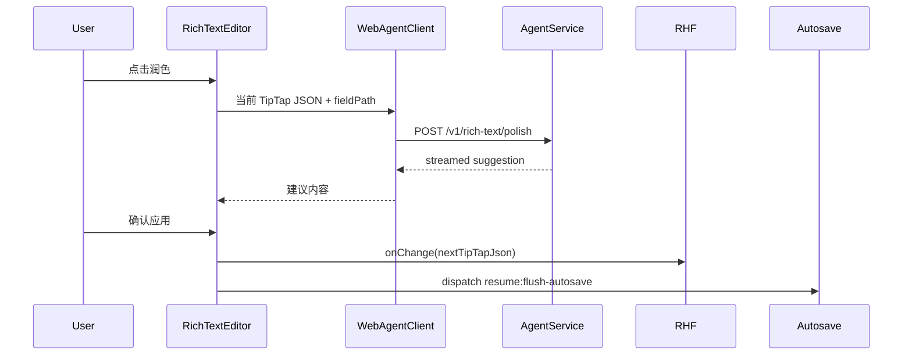
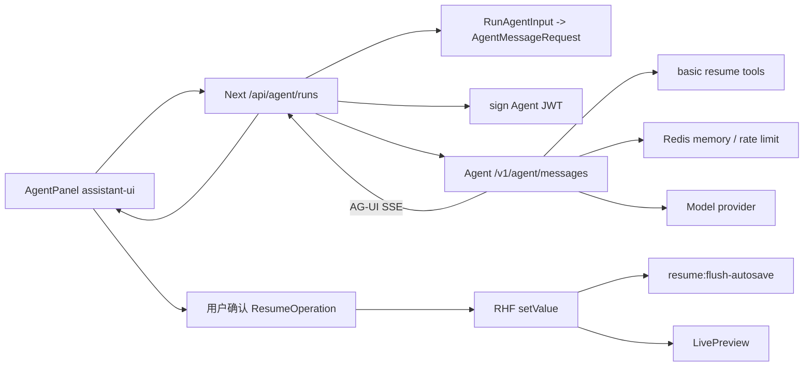

# Frontend Reuse Strategy

本文档说明新增 Agent 能力如何复用 intro-builder 现有前端页面表现，而不是另起一套 UI。

## 当前前端基线

关键入口：

- `app/(app)/resume/[id]/edit/editor-client.tsx`
- `components/editor/rich-text-editor.tsx`
- `components/preview/live-preview.tsx`
- `components/ui/button.tsx`
- `components/ui/sheet.tsx`
- `components/ui/popover.tsx`
- `hooks/use-resume-autosave.ts`

当前编辑器特征：

- `EditorClient` 用 React Hook Form 维护简历内容。
- `LivePreview` 通过 `useWatch()` 订阅表单状态。
- autosave 是 2 秒 debounce 串行队列。
- TipTap 内容以 JSON 存储，不是 HTML。
- UI 使用 shadcn/base-ui 风格原语、lucide icon、sonner toast。
- 编辑器已有右侧 preview、模板面板、协作控件、导出控件。

## 复用原则

1. 不新增一套独立视觉系统。
2. 不让 Agent 直接写 Postgres。
3. 不绕过 React Hook Form。
4. 不把 `content` 当 prop 一路传进 `LivePreview`。
5. 不让 assistant-ui 进入 Phase 1 的富文本按钮。
6. 所有 AI 输出先是 suggestion，用户确认后才写回。
7. 保存仍由现有 autosave 负责。

## Phase 1: 富文本润色按钮

推荐位置：

- `components/editor/rich-text-editor.tsx` toolbar。
- 使用 lucide `Sparkles` 或类似 icon。
- 放在现有字号/颜色工具旁边，但和基础格式按钮视觉一致。

推荐组件：

```text
components/agent/rich-text-polish-button.tsx
components/agent/polish-suggestion-popover.tsx
lib/agent/client.ts
```

数据流：



UI 行为：

- loading 时按钮 disabled。
- 用户取消时 abort 请求。
- 成功后显示 suggestion popover 或 inline suggestion card。
- 用户点击“应用”才写回。
- 用户点击“保留原文”不改变 RHF。
- 失败用 sonner toast 展示中文错误。

不做：

- 不展示聊天线程。
- 不保存 Agent 记忆。
- 不自动覆盖原文。
- 不调用 assistant-ui。

## Phase 2: 简历模块级 Helpers

推荐入口：

- Section header 右侧小按钮。
- `CompletenessScore` 附近的建议入口。
- 模板面板不承载 Agent helper。

### Phase 2A: Resume Helpers

`resume-diagnose` 放在编辑器顶部工具区，靠近完整度信息，给出整份简历的下一步建议。`section-next-steps` 放在模块 header，覆盖工作经历、项目经历、教育经历、研究经历、技能和自定义模块。

Phase 2A 的 UI 只展示 suggestion cards，不把生成内容自动写回 RHF，也没有 apply/cancel patch 流程。按钮用于引导 AI 能力：文字与图标使用渐变色，按钮背景保持现有编辑器表面风格，不做渐变背景。

推荐组件：

```text
components/agent/section-helper-button.tsx
components/agent/resume-diagnose-button.tsx
components/agent/resume-helper-card.tsx
```

数据边界：

- 输入可以包含当前 section、相邻 section 摘要、目标岗位文本。
- 输出必须是结构化建议。
- 写回必须由用户确认。
- autosave 仍使用现有队列。

## Phase 3: assistant-ui Agent Panel

推荐入口：

- `EditorClient` 顶部工具区新增 `Agent 模式`，使用 `MessageSquare` 作为自然入口。
- Phase 3A 采用已确认的 A 方案：点击后左侧编辑列切换为 Agent panel，右侧 `LivePreview` 保持可见。
- 桌面首版不做右侧 drawer，也不把 Agent panel 叠在 preview 上。
- 移动端 Agent panel 暂不在 Phase 3A 解决；Phase 3B 再评估 `Sheet`。

推荐组件：

```text
components/agent/agent-mode-toggle.tsx
components/agent/agent-panel.tsx
components/agent/agent-runtime-provider.tsx
components/agent/agent-preset-workflows.tsx
components/agent/agent-tool-card.tsx
components/agent/agent-confirmation-card.tsx
app/api/agent/messages/route.ts
```

布局建议：

- Desktop: 左列原地从 editor 切换为 Agent panel，右列 preview 常驻。
- Agent mode 激活时隐藏或禁用 resize handle，避免 panel 与 preview 比例被拖到不可用状态。
- composer 固定底部。
- message list 独立滚动。
- 切换 Agent mode 不重置 RHF form、autosave 队列、section order、模板选择或 preview。
- Template panel 与 Agent panel 互斥；打开 Agent mode 时关闭模板面板。

assistant-ui 复用方式：

- 使用 assistant-ui runtime 管理 chat thread/composer/tool display，但不让 assistant-ui 拥有简历状态。
- Phase 3B 使用 LocalRuntime/custom adapter + AG-UI SSE BFF；adapter 返回 async generator，逐步 yield assistant text。
- Phase 3C 起 Agent panel 发送标准 AG-UI `RunAgentInput` 到 `/api/agent/runs`；Web-owned `resumeId`、`workflowId` 和 capped RHF context 放在 `forwardedProps.introBuilder`。
- 使用本项目 `Button`、`Input`/`Textarea`、`Separator` 包装视觉。
- message bubble 和 tool result 样式使用现有 `bg-muted`、`text-muted-foreground`、`border` token。
- 不直接使用 assistant-ui 默认主题覆盖全局设计。

数据流：



Phase 3B 基础简历修改 tools：

| Tool | 用途 | 写入边界 |
| --- | --- | --- |
| `resume_read` | 读取 Web 提供的简历快照，诊断结构和风险 | 只读 |
| `resume_update_section` | 更新 summary 或 allowlist 富文本 section | 返回 `update_section`，确认后由 Web 写回 |
| `resume_delete_section` | 删除 section/item target | 返回 `delete_section`，当前只展示不自动执行 |
| `resume_reorder_sections` | 调整模块顺序 | 返回 `reorder_sections`，确认后由 Web 写回 |
| `resume_insert_section` | 插入 section/item 草稿 | 返回 `insert_section`，当前只展示不自动执行 |

所有 `ResumeOperation` 都必须经过 `AgentConfirmationCard`，用户点击 `应用` 后才进入 RHF。

## 与现有页面的复用点

| Existing piece | Reuse plan |
| --- | --- |
| `Button` | Agent trigger、toolbar action、apply/cancel |
| `Sheet` | Phase 3B 移动端 Agent panel |
| `Popover` | Phase 1 polish suggestion |
| `sonner` | 错误、成功、rate limit 提示 |
| `lucide-react` | `Sparkles`、`MessageSquare`、`StopCircle`、`RotateCcw` |
| `useResumeAutosave` | Agent 写回后的保存队列 |
| `formatSaveError` | Web 写回失败时复用错误格式 |
| `LivePreview` | 不改；只通过 RHF 变化自然更新 |
| `RichTextEditor` | Phase 1 按钮入口 |

## 不复用的点

- 不复用 collab voice chat 状态。
- 不复用 template preview drawer 承载 Agent panel。
- 不把 Agent panel 塞进 dashboard card。
- 不把 assistant-ui message state 存进 resume content。

## 状态管理边界

Agent UI 可以读取：

- 当前 resume id。
- 当前 section key。
- 当前 TipTap JSON。
- 当前简历摘要。
- 当前模板 id。

Agent UI 不能直接写：

- Postgres。
- `resume.content` 的任意深层字段。
- `templateId`。
- `isPublic`。
- collaboration session。

写回通道：

- Phase 1：`RichTextEditor.onChange(nextJson)`。
- Phase 2：section editor 的现有 RHF field array / controller。
- Phase 3B：Agent 返回 `ResumeOperation`，用户确认后由 `EditorClient` 的 allowlisted dispatcher 调用 `form.setValue(...)`，再 dispatch `resume:flush-autosave`。

Phase 3A allowlist：

- `basics.summary`
- `experience.<index>.content`
- `projects.<index>.content`
- `education.<index>.highlights`
- `research.<index>.content`
- `skills`
- `custom.<index>.content`

富文本写回规则：

- TipTap JSON 是唯一富文本存储格式，不接受 HTML。
- 原文是无序列表或有序列表时，Agent patch 必须保持对应列表结构。
- Agent 不得把列表润色成一整段无结构文本。
- STAR 优化只能重排和强化已有事实；缺失 Result 指标时用 `needs_user_fact` 提醒用户补充。

## 性能策略

- Agent panel 默认 lazy mount。
- assistant-ui 只在 panel 打开后加载。
- 不把完整 resume content 每个 token 都重新传给 assistant-ui runtime。
- 发送消息时用 `form.getValues()` 生成 capped context，并放进 `forwardedProps.introBuilder`；不要在 Agent panel 高频 `useWatch()` 整份简历。
- 对上下文按 section 裁剪。
- 避免在 `EditorClient` 顶层新增高频 state。

## 可访问性与中文文案

- 所有 icon button 必须有 `title` 或 `aria-label`。
- 面向用户文案使用中文。
- 错误消息不暴露 provider 原始异常。
- loading 文案要短，例如“润色中”“正在思考”。
- rate limit 文案要给出可行动信息，例如“稍后再试”。

## 验收清单

- Phase 1 按钮不会影响普通 TipTap 输入。
- 应用建议后 preview 通过现有 RHF/watch 自动更新。
- 应用建议后 autosave flush。
- 取消请求不会写回部分结果。
- assistant-ui panel 只在 Phase 3 引入。
- `Agent 模式` 打开后左侧变为 Agent panel，右侧 preview 仍可见。
- panel 关闭再打开不破坏编辑器表单状态。
- 至少一个 preset workflow 能返回 assistant message、tool card 和待确认 patch。
- patch 点击 `应用` 前不改变 RHF；点击后 preview 和 autosave 通过既有路径更新。
