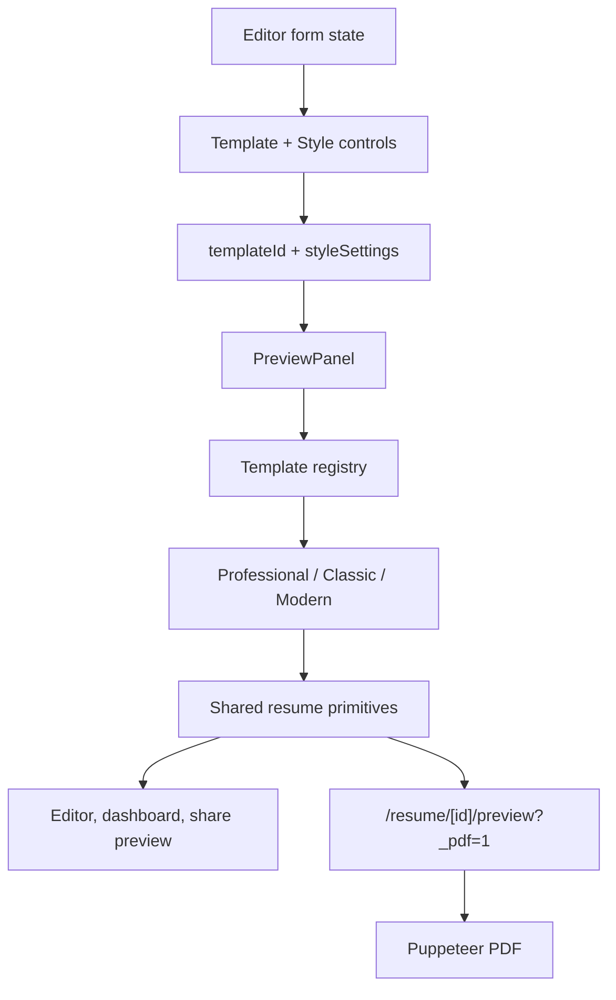

# intro-builder v0.3 — Template + Editor UX Deep Optimization

## 1. Why This Exists

The product can already edit structured resume content, preview templates, upload photos, reorder sections, and export PDFs. The next bottleneck is output quality: the current Classic and Modern templates look functional but not polished enough to feel like a professional resume builder. Typography, spacing, metadata hierarchy, list rhythm, and PDF page behavior are inconsistent. The editor also exposes layout controls as isolated sliders, so users do not get a confident “I am choosing a polished resume style” experience.

This release turns template quality into a first-class product surface. It adds a new default `Professional` template and upgrades the editing experience around template and typography choices, while preserving the current content model and DOM-to-PDF pipeline.

## 2. Goals

- Ship a new `Professional` template as the default, optimized for Chinese internet job applications: clean, dense enough for one-page resumes, ATS-friendly, and PDF-stable.
- Refactor Classic and Modern around shared resume template primitives so all templates use consistent typography, spacing, rich-text rendering, and print-safe behavior.
- Upgrade the editor’s “排版设置” area into a “模板与排版” control surface with template cards and layout presets.
- Preserve the existing `ResumeContent` shape, `sectionOrder`, custom sections, photo support, autosave behavior, public share behavior, and Puppeteer PDF route.
- Improve confidence through targeted unit tests and manual visual acceptance cases.

## 3. Non-Goals

- No template marketplace.
- No user-uploaded custom templates.
- No AI rewrite or content generation.
- No collaborative editing.
- No public PDF download from shared `/r/[slug]` pages.
- No cross-section item drag-and-drop.
- No database schema migration unless a small `templateId` enum/default adjustment is strictly required by existing code.

## 4. Product Decisions

### 4.1 Template Set

The app will have three built-in templates:

- `professional` — default and recommended. Single-column, recruiter-friendly, Chinese reading optimized, strong information hierarchy, limited accent color.
- `classic` — simple single-column fallback with minimal styling, still improved through shared primitives.
- `modern` — two-column visual option, less cramped than today, suitable for candidates who want a more designed layout.

New resumes should default to `professional`. Existing resumes keep their stored `templateId`; if older data has an unknown or missing template id, fall back to `professional`.

### 4.2 Visual Direction

`Professional` should feel like a paid resume builder output, not a decorated website card. The template uses:

- White paper, black/neutral text, restrained accent line.
- Strong name block with title beneath or adjacent.
- Contact metadata in a compact row with separators or small icons.
- Section titles with consistent width, spacing, and line treatment.
- Experience/project item headers that clearly separate organization, role/stack, and date.
- Rich-text body with consistent paragraph/list spacing, no typography-plugin surprises.
- Page rhythm that can support both one-page and two-page resumes.

### 4.3 Editor Experience

The current `StyleEditor` becomes a “模板与排版” control group:

- Template cards for Professional / Classic / Modern, each with name, short description, and selected state.
- Layout density presets:
  - `紧凑`: smaller font, tighter line height, smaller padding.
  - `标准`: default professional spacing.
  - `舒展`: larger line height and padding for lower-density resumes.
- Manual controls remain available for font, font size, line height, and page padding.
- Changes continue to use the existing React Hook Form state and 2-second autosave.
- The right preview updates immediately when template or style settings change.

The editor should not add a new persistence model for presets. Presets write concrete values into the existing `styleSettings` object.

## 5. Architecture

### 5.1 Shared Template Primitives

Create template-only building blocks under `lib/templates/shared/`:

- `ResumePage` — owns paper background, max width, font family, page padding, base font size, line height, and print-safe class names.
- `ResumeHeader` — renders name, title, photo, summary, and contact metadata in a template-configurable layout.
- `ResumeSection` — renders section heading, optional icon/accent, and print-safe wrapping.
- `ResumeItemHeader` — renders title/organization, secondary metadata, and date/location rows.
- `ResumeRichText` — wraps `RichTextRenderer` with resume-specific prose classes so TipTap HTML looks consistent across templates.
- `getTemplateStyleVars` or equivalent helper — derives CSS custom properties from `StyleSettings`.

Classic, Modern, and Professional should compose these primitives instead of each independently defining section spacing, prose classes, and item header patterns.

### 5.2 Template Registry

Keep `lib/templates/index.ts` as the public registry, but extend it to include:

- `professional` metadata.
- `isRecommended` or `badge` metadata for UI cards.
- Stable label/description strings for editor and dashboard use.

Avoid scattering template names across editor, dashboard, landing, and actions.

### 5.3 Data Flow

## 6. Template Details

### 6.1 Professional

Professional is the new default. It is single-column and should handle Chinese text well.

Header:

- Name: large but not oversized.
- Target title: close to name, visually secondary.
- Contact row: email, phone, location, website in a compact row.
- Photo: optional. If present, use a small right-aligned portrait that does not dominate. If absent, header remains balanced.
- Summary: optional short paragraph under contact row, visually integrated rather than treated as a large separate block.

Sections:

- Built-in sections use labels from `SECTION_META`, but visual treatment should be more subtle than the editor icons.
- Section heading should not consume too much vertical space.
- Experience and projects should use clear item headers:
  - Left: company/project name and role/stack.
  - Right: date range when present.
  - Below: location or stack metadata if needed.
- Rich-text body should favor compact bullets with enough line height for Chinese readability.

Custom sections:

- Render in `sectionOrder` like built-in sections.
- Unknown custom section ids use `getSectionMeta` fallback behavior.

### 6.2 Classic

Classic remains a conservative single-column template. It should become more polished, but not visually heavy:

- Keep centered name header.
- Improve contact row spacing and wrapping.
- Use the shared section and item header primitives.
- Keep the overall look minimal and ATS-friendly.

### 6.3 Modern

Modern remains a two-column template:

- Sidebar width should be less cramped for Chinese content.
- Skills and education can stay in sidebar, but long content should wrap cleanly.
- Main column uses the same item and rich-text primitives.
- Accent color should be restrained and PDF-safe.

## 7. PDF and Print Rules

All templates must remain compatible with the existing DOM-to-PDF flow.

Requirements:

- Resume paper is always light: `bg-white text-black` or equivalent.
- Template root uses A4-friendly width and print-safe sizing.
- Sections and item headers use `break-inside: avoid` where appropriate.
- Avoid orphan section headings at page bottoms as much as CSS allows.
- Do not depend on client-only measurements for printed layout.
- Do not use `next/image` in template output; use plain `` for photo rendering to keep Puppeteer behavior predictable.
- Continue waiting for browser fonts before `page.pdf`.

## 8. Editor UX Details

### 8.1 Template Cards

Template cards live in the editor’s left panel near the current style controls. Each card includes:

- Template label.
- One-line positioning statement.
- Selected state.
- Optional `推荐` badge for Professional.

Clicking a card updates `templateId` immediately and marks the form dirty.

### 8.2 Density Presets

Presets map to concrete `styleSettings` values:

- `紧凑`: for content-heavy one-page resumes.
- `标准`: default.
- `舒展`: for early-career or lower-content resumes.

Manual slider changes still work after selecting a preset. The UI does not need to track a separate “active preset” after manual edits.

### 8.3 Preview Stage

The preview pane should communicate “this is paper” more clearly:

- Maintain white resume paper regardless of app theme.
- Use stable scale and centered stage.
- Avoid overly heavy borders around the resume itself.
- Keep mobile tabs unchanged, but the preview tab should show the same improved paper stage.

## 9. Files Likely Touched

- `lib/templates/index.ts`
- `lib/templates/professional/meta.ts`
- `lib/templates/professional/Layout.tsx`
- `lib/templates/shared/*`
- `lib/templates/classic/Layout.tsx`
- `lib/templates/modern/Layout.tsx`
- `components/preview/rich-text-renderer.tsx`
- `components/preview/preview-panel.tsx`
- `components/editor/style-editor.tsx`
- `app/(app)/resume/[id]/edit/editor-client.tsx`
- `app/(app)/dashboard/page.tsx`
- `app/(marketing)/page.tsx`
- `lib/resume-schema.ts`
- `lib/demo-resume.ts`
- `tests/unit/templates-classic-layout.test.tsx`
- New unit tests for Professional, Modern, template registry, style presets, and shared primitives.

## 10. Testing and Acceptance

Automated tests:

- Template registry includes Professional and marks it recommended/default.
- `emptyResumeContent` and `createResume` default to Professional where appropriate.
- Professional renders name, title, contact, photo, summary, section headings, rich-text content, and custom sections.
- Classic and Modern still render existing content after shared primitive refactor.
- Density presets write expected concrete `styleSettings`.
- Resume paper root remains light and print-safe.

Manual visual acceptance:

- One-page Chinese resume without photo.
- One-page Chinese resume with photo.
- Two-page content-heavy resume with multiple experience/project entries.
- Classic / Modern / Professional switching without content loss.
- Dashboard preview cards show a professional first impression.
- PDF export matches preview closely and does not show obvious section heading orphaning.

## 11. Risks and Mitigations

- **Risk: shared primitives flatten template personality.** Mitigation: primitives own rhythm and structure, while each template controls composition and accent treatment.
- **Risk: adding Professional increases template registry complexity.** Mitigation: keep metadata centralized in `lib/templates/index.ts`.
- **Risk: PDF page breaks remain imperfect.** Mitigation: add CSS `break-inside` rules and manual two-page acceptance checks; avoid JS layout measurement in this iteration.
- **Risk: font rendering differs across local, Vercel, and Puppeteer.** Mitigation: use conservative font stacks and rely on existing font-ready guard; defer bundled CJK font strategy to a separate font-specific spec if needed.
- **Risk: editor style controls become too large.** Mitigation: use compact cards and collapsible advanced/manual controls.

## 12. Implementation Order

1. Add shared template primitives and tests.
2. Add Professional template and registry metadata.
3. Make new resumes and demos prefer Professional.
4. Refactor Classic and Modern onto shared primitives.
5. Upgrade StyleEditor into “模板与排版” controls with presets.
6. Polish preview/dashboard/landing template presentation.
7. Add PDF/print CSS refinements.
8. Run full verification and manual visual acceptance.

## Self-Review

- **Placeholder scan:** No TBD/TODO placeholders remain.
- **Internal consistency:** The design keeps one DOM template pipeline for preview/share/PDF and does not reintroduce `react-pdf`.
- **Scope check:** This is larger than a simple visual patch, but still one coherent subsystem: built-in template output and the editor controls that select/style it. It avoids AI, marketplace, collaboration, and user-uploaded templates.
- **Ambiguity check:** Professional is explicitly the new default; Classic and Modern are retained and improved; presets write concrete existing `styleSettings` values rather than adding a new persistence model.
