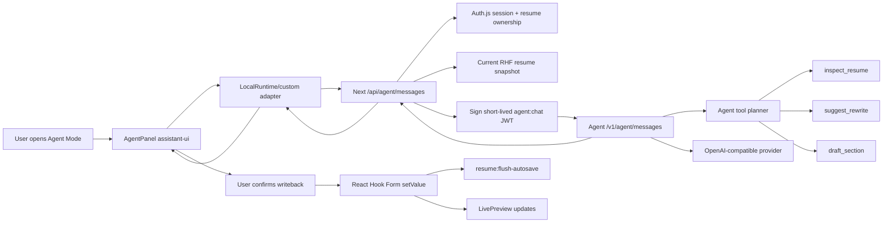

# Agent Mode assistant-ui Design

## Status

Approved direction from product discussion: skip Phase 2B for now and start Phase 3 with an **Agent Mode** that replaces the left editor panel with an assistant-ui powered Agent panel while keeping the right resume preview visible.

## Problem

intro-builder already has small AI actions:

- Rich-text polish button.
- Resume diagnosis button.
- Section helper buttons.

Those actions are useful but isolated. They do not create the feeling of “an agent is guiding me through improving this resume.” Phase 3 should introduce a multi-turn assistant surface that can run preset resume workflows, show tool calls, ask follow-up questions, and propose edits without taking control away from the user.

The core product challenge is choosing a chat/agent layout that fits a resume editor. A generic right-side chatbot is easy to add, but it competes with preview space and feels detached from the editing workflow. A full-screen agent workspace is powerful but too heavy for a first iteration. The most fitting mode is a deliberate editor mode switch.

## Decision

Use **Agent Mode Replaces Left Editor** as the Phase 3 product shape.

When the user clicks `Agent 模式` in the editor toolbar:

1. The current left editor panel is replaced by an Agent panel.
2. The existing right-side `LivePreview` remains visible.
3. The editor form stays mounted and keeps React Hook Form state, autosave state, section order, template state, and scroll state.
4. The Agent panel runs assistant-ui message/thread UI and shows preset resume workflows.
5. Agent tools can inspect current form state and generate suggestions/drafts.
6. Any writeback into RHF must be user-confirmed.

This matches the user’s preferred direction: “点击切换 agent 模式，左侧面板会收起，变为一个 agent panel.”

## Options Considered

| Option | Shape | Pros | Cons | Decision |
| --- | --- | --- | --- | --- |
| A. Agent Mode replaces left editor | Left editor panel becomes Agent panel; preview remains | Best fit for guided resume work; keeps preview visible; makes Agent feel like a mode, not a widget | Requires careful state preservation | Choose |
| B. Right drawer Agent | Add chat drawer on the right side | Simple mental model; leaves editor visible | Compresses preview; feels like generic support chat; weaker workflow framing | Reject for MVP |
| C. Full Agent workspace | Full-page agent workflow with side timeline | Most powerful long-term coaching experience | Too heavy; interrupts editor; higher navigation/state complexity | Defer |

## Runtime Decision

Use assistant-ui for the Agent panel, but do not let assistant-ui own product state.

Recommended Phase 3A runtime:

```text
AssistantRuntimeProvider
  -> assistant-ui Thread / Composer / Tool UI
  -> LocalRuntime or custom model adapter
  -> Next.js POST /api/agent/messages
  -> Agent POST /v1/agent/messages
  -> model provider + tool planner
```

Why LocalRuntime/custom adapter first:

- Our product needs human-confirmed writeback tools.
- Current Agent service already has HTTP JSON endpoints and structured error envelopes.
- We can run the full assistant-ui thread/composer/tool display loop without committing to a final streaming protocol too early.
- DataStream/SSE can be Phase 3B after the message and tool contracts prove stable.

Deferred streaming upgrade:

```text
assistant-ui DataStream runtime
  -> Web streaming BFF
  -> Agent streaming /v1/agent/messages
```

The upgrade should use assistant-ui’s current default protocol or an explicit protocol setting. Do not feed custom line-delimited JSON into assistant-ui without an adapter.

## Layout

Desktop editor layout:

```text
Toolbar
  [模板] [智能排版] [样式] [模块管理] [AI 诊断] [Agent 模式] ... [保存状态]

Main area
  Left column:
    Edit mode  -> existing section editors
    Agent mode -> AgentPanel

  Resize handle:
    hidden or disabled while Agent mode is active in Phase 3A

  Right column:
    existing LivePreview
```

Agent mode panel contents:

```text
AgentPanel
  Header
    title: 简历 Agent
    subtitle: 读取当前表单快照，不会自动修改
    action: 切回编辑

  Preset workflows
    - 诊断整份简历
    - 目标岗位匹配
    - 经历 STAR 优化
    - 终检导出前检查

  assistant-ui Thread
    messages
    tool call cards
    pending confirmation cards

  Composer
    free text input
    optional quick prompts
```

Mobile:

- Keep current desktop-first editor limitation for Phase 3A.
- Do not solve mobile Agent panel in this slice.
- Phase 3B can introduce `Sheet` once desktop Agent Mode is validated.

## Data Flow



## Web Responsibilities

Web remains the product authority:

- Auth.js session validation.
- Resume ownership validation.
- Reading current RHF snapshot.
- Signing `agent:chat` JWT.
- Proxying to Agent service.
- Rendering assistant-ui panel.
- Applying user-confirmed changes into RHF.
- Triggering autosave flush after confirmed writes.
- Keeping `LivePreview` driven by RHF, not Agent state.

Web must not:

- Send provider API keys to browser.
- Let assistant-ui write resume content directly.
- Store assistant-ui message state in `resume.content`.
- Migrate OCR/import/AI parsing into Agent.

## Agent Service Responsibilities

Agent service owns new Agent behavior:

- `POST /v1/agent/messages`.
- Prompt construction for chat/workflow mode.
- Tool planning and tool result shaping.
- Redis memory/rate limit.
- Provider timeout and structured error envelopes.
- Returning messages/tool events in the contract Web expects.

Agent must not:

- Connect to Postgres.
- Mutate resume content directly.
- Publish resumes.
- Delete sections.
- Change templates without explicit Web-side confirmation.

## Tool Model

Phase 3A tool classes:

| Tool | Reads | Writes | Purpose |
| --- | --- | --- | --- |
| `inspect_resume` | Current RHF snapshot summary | No | Diagnose completeness, missing evidence, section risks |
| `suggest_rewrite` | Target field text + context | No | Produce a candidate rewrite/diff |
| `draft_section` | Resume context + user goal | No direct write | Produce a section draft requiring confirmation |
| `explain_template` | Current template/style settings | No | Explain layout/template effects |

Writeback action is not an Agent tool. It is a Web UI confirmation action:

```text
Tool result -> confirmation card -> user clicks Apply -> Web setValue -> autosave flush
```

Disallowed tools:

- `save_resume_without_confirmation`
- `delete_section`
- `publish_resume`
- `change_template_without_confirmation`
- `send_resume_to_external_service`

## Preset Workflows

Preset workflows are not separate pages. They are starter prompts plus tool policy.

### 1. 诊断整份简历

Goal: Give a ranked list of the top 3-5 improvements.

Likely tool sequence:

```text
inspect_resume -> model diagnosis -> suggestion cards
```

### 2. 目标岗位匹配

Goal: User provides target role/job description; Agent identifies mismatch and missing evidence.

Likely tool sequence:

```text
inspect_resume -> ask for target if missing -> compare -> suggestions
```

### 3. 经历 STAR 优化

Goal: Improve one selected experience/project item using STAR, without inventing metrics.

Likely tool sequence:

```text
inspect_resume -> ask user to choose section/item -> suggest_rewrite -> confirmation card
```

### 4. 终检导出前检查

Goal: Before PDF export, check formatting/content risks.

Likely tool sequence:

```text
inspect_resume -> explain_template -> final checklist
```

## UX Details

Toolbar:

- Add one `Agent 模式` button using `MessageSquare` or `Sparkles`.
- Use gradient text/icon treatment consistent with existing AI buttons.
- Button has selected state when Agent mode is active.

Left panel replacement:

- Do not unmount the form provider.
- Prefer keeping editor subtree mounted but visually hidden if this is feasible without large bundle/performance cost.
- If the editor subtree must unmount, prove with tests that RHF state persists and autosave does not regress.
- Template panel and Agent panel are mutually exclusive.

Agent panel:

- Header explains safety: “AI 会读取当前表单快照，修改需你确认。”
- Preset workflow chips sit above the thread.
- Thread body scrolls independently.
- Composer remains sticky at bottom.
- Tool calls render as cards, not raw JSON.
- Pending writeback uses explicit `应用` / `忽略`.

Preview:

- Always visible on desktop.
- Updates only from RHF changes.
- Agent mode should not replace preview with chat.

## Suggested Files

Web UI:

```text
components/agent/agent-mode-toggle.tsx
components/agent/agent-panel.tsx
components/agent/agent-runtime-provider.tsx
components/agent/agent-preset-workflows.tsx
components/agent/agent-tool-card.tsx
components/agent/agent-confirmation-card.tsx
```

Web route/client:

```text
app/api/agent/messages/route.ts
lib/agent/chat-client.ts
lib/agent/chat-context.ts
```

Agent service:

```text
apps/agent/src/agent-messages.ts
apps/agent/src/agent-tools.ts
apps/agent/tests/agent-messages.test.ts
apps/agent/tests/agent-tools.test.ts
```

Editor integration:

```text
app/(app)/resume/[id]/edit/editor-client.tsx
tests/unit/editor-client-agent-mode.test.tsx
```

Docs:

```text
docs/agent/assistant-ui-research.md
docs/agent/frontend-integration.md
docs/agent/service-contracts.md
docs/agent/implementation-roadmap.md
```

## MVP Acceptance Criteria

Phase 3A is complete when:

- `Agent 模式` can be toggled from the desktop editor toolbar.
- Left panel switches to an assistant-ui Agent panel.
- Right `LivePreview` remains visible.
- The panel can start at least one preset workflow.
- assistant-ui thread/composer renders and can complete one Agent response.
- At least one visible tool call is shown in the thread.
- Tool result cannot mutate resume content without explicit user confirmation.
- Confirmed writeback uses RHF `setValue` and triggers `resume:flush-autosave`.
- Closing Agent mode does not reset form state.
- Existing rich-text polish and Phase 2A helper buttons still work.

## Testing Strategy

Unit tests:

- Agent route validates `agent:chat` JWT and rejects wrong scope.
- Web BFF validates Auth.js session and resume ownership.
- Runtime adapter maps assistant-ui messages to Web BFF requests.
- Preset workflow chips create the expected initial user message.
- Tool result cards render readable status and content.
- Confirmation card applies only after user click.
- Editor mode toggle preserves RHF values.

Integration/manual smoke:

```bash
pnpm verify
pnpm agent:build
```

Manual:

1. Open `/resume/<id>/edit`.
2. Toggle `Agent 模式`.
3. Click `诊断整份简历`.
4. Verify assistant-ui thread shows user/assistant messages.
5. Verify at least one tool card renders.
6. Confirm any writeback card requires explicit apply.
7. Toggle back to edit mode.
8. Verify unsaved form edits and autosave state are preserved.

## Risks

- assistant-ui APIs and streaming protocol can evolve; implementation must check installed package docs before coding.
- If assistant-ui is imported directly into `editor-client.tsx`, editor initial bundle may grow too much.
- If tool writeback bypasses Web confirmation, user trust breaks.
- If the editor subtree unmounts incorrectly, form state or autosave can regress.
- If the Agent message route streams through Vercel and exceeds timeouts, Phase 3B may need direct browser -> Agent streaming with short-lived token and CORS hardening.

## Open Questions For Implementation Plan

1. Which assistant-ui package version should be pinned once implementation starts?
2. Should Phase 3A use LocalRuntime only, or implement DataStream from the first PR if current docs and package version are stable?
3. Which single workflow should be the first end-to-end smoke: `诊断整份简历` is recommended.
4. Should Agent mode hide or keep mounted the existing editor subtree? The implementation plan should inspect RHF behavior before choosing.
