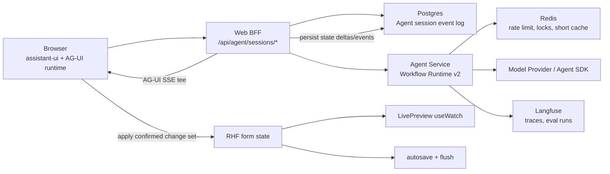
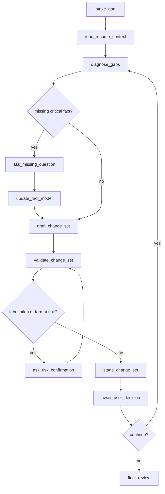
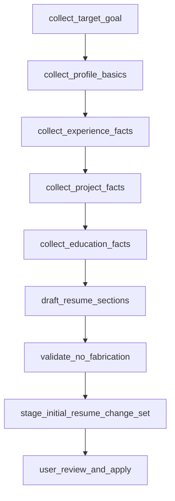

# Agent Workflow Runtime v2 Architecture Design

Date: 2026-06-12

## Summary

intro-builder 当前 Agent Mode 已经接入 AG-UI streaming 和 assistant-ui，但本质仍是“单次模型调用 + JSON 解析 + 合成工具事件 + 用户确认写回”。这能支撑短问答和单轮修改建议，但不适合后续的 workflow 编排、多轮 tool call、多次追问、从 0 制作简历的长 session。

Agent v2 的核心变化是新增一个产品级 Agent Session / Workflow Runtime 层，并把长上下文能力做成一等公民。AG-UI 继续做浏览器和 Agent 之间的事件协议，assistant-ui 继续做 thread、composer、message、tool display 和 human-in-the-loop 交互；真正的长循环、状态机、工具策略、事实收集、change set 管理、200k 级上下文打包由新的 Workflow Runtime 和 Resume Workspace 承担。

推荐架构：

```text
assistant-ui / AG-UI UI
  thread, composer, visible events, interrupt controls

Web BFF
  auth, resume ownership, durable agent session store, event persistence, RHF apply bridge

Agent Workflow Runtime
  workflow graph, real tool loop, 200k context packing, questions, approvals, validation, tracing

Resume Workspace
  facts, draft resume, staged change sets, user decisions, quality report
```

## Current Baseline

Current key files:

- `apps/agent/src/agent-messages.ts`: validates one request, builds one prompt, expects provider JSON, parses `message/toolCalls/proposedOperations`, then synthesizes AG-UI events.
- `apps/web/lib/agent/ag-ui-run-adapter.ts`: maps `RunAgentInput` to the current `AgentMessageRequest`; interrupt resume is currently injected back as an assistant message.
- `apps/web/components/agent/agent-ag-ui-runtime-provider.tsx`: wraps `HttpAgent` and `useAgUiRuntime`, observes text/tool/interrupt events.
- `apps/web/components/agent/agent-panel.tsx`: renders assistant-ui thread, turn artifacts, question cards, approval cards, batch apply/reject.
- `apps/web/app/(app)/resume/[id]/edit/editor-client.tsx`: owns `applyAgentOperation()` through RHF `setValue()` and autosave flush.
- `apps/web/components/preview/live-preview.tsx`: preview subscribes to RHF through `useWatch()`.

Current constraints that remain valid:

- Browser must call Web BFF, not Agent service directly.
- Web owns Auth.js session, resume ownership checks, RHF state, autosave, Postgres resume writes, template, preview and PDF.
- Agent service must not directly mutate RHF or Postgres resume content.
- Any resume mutation must become a `ResumeOperation` or `ResumeChangeSet`, then be applied by Web after user confirmation.
- `LivePreview` must remain RHF-driven; do not pass `content` props through Agent UI.
- TipTap JSON remains the rich text storage format.

Current limitations:

- `toolCalls` are not real runtime tool calls; they are model-emitted JSON fields that are converted into AG-UI events after parsing.
- `workflowId` is a prompt hint, not a state machine.
- There is no durable Agent session model, no workspace snapshot, no event log and no resumable workflow state.
- Questions and approvals are UI-level interrupt cards, but the Agent runtime does not own a typed pending-question model.
- Applying a change updates RHF, but the session does not retain a first-class record of which change set was staged, applied, rejected or superseded.
- The provider must return one valid JSON object, which makes long tool loops brittle and forces late failure if parsing breaks.

## Goals

1. Support long Agent sessions for:
   - optimizing an existing resume,
   - creating a resume from zero,
   - iteratively collecting facts,
   - staging multiple change sets,
   - repeatedly asking questions,
   - resuming after approval, rejection, page refresh or model failure.
2. Make tool calls real runtime events with typed server tools and deterministic validators.
3. Preserve the current write boundary: Agent proposes, Web applies, RHF preview updates.
4. Use AG-UI for lifecycle, text streaming, tool events, state deltas, activity progress and interrupts.
5. Use assistant-ui for the chat surface and human controls, not for product state ownership.
6. Make Langfuse traces and offline evals meaningful at workflow step, tool, question and change-set level.
7. Provide at least 200k tokens of effective input context budget for Agent v2 runs, and show context usage/status in the Agent Mode UI.

## Non-Goals

- Do not migrate OCR, import-resume or existing AI parsing into Agent v2.
- Do not let Agent service write final resume content to Postgres.
- Do not replace assistant-ui with a custom chat UI.
- Do not make AG-UI or assistant-ui the workflow engine.
- Do not introduce a separate visual system for Agent Mode.
- Do not auto-apply changes without explicit user confirmation.

## Architecture Overview



The main shift is that the Web BFF becomes the durable session boundary. It already owns auth and resume DB writes, so it should also own Agent session persistence. The Agent service receives a session snapshot, runs workflow logic, emits AG-UI events, and returns updated workspace state through `STATE_DELTA` / `STATE_SNAPSHOT` events. Web BFF tees the stream: it forwards events to the browser while persisting workflow-relevant events.

This keeps the Agent service focused on runtime execution and avoids giving it direct Postgres ownership over user data.

## Ownership Boundaries

| Layer | Owns | Does Not Own |
| --- | --- | --- |
| Browser | assistant-ui runtime, visible thread, composer, interrupt controls, local pending UI, RHF apply action | provider keys, durable source of truth, direct Agent service calls |
| Web BFF | Auth.js session, resume ownership, Agent session store, AG-UI stream tee, resume context building, apply bridge | model reasoning, long-loop planning, provider orchestration |
| Agent Runtime | workflow graph, tool policy, step execution, fact extraction, question planning, change-set staging, validation, Langfuse trace spans | final resume writes, user auth, template rendering, autosave |
| Resume Workspace | facts, drafts, staged changes, decisions, quality report, workflow cursor | final published resume truth |
| Redis | rate limits, replay guard, run locks, short-lived cache | durable session history |
| Postgres | durable resume data and durable Agent session event log | transient provider streaming chunks |

## Durable Session Model

Agent v2 introduces a durable `AgentSessionSnapshot` stored by Web. The Agent service receives this snapshot on every run and emits patches back.

```ts
type AgentSessionSnapshot = {
  sessionId: string;
  threadId: string;
  resumeId: string | null;
  userIdHash: string;
  mode: "optimize_existing" | "create_from_zero";
  status: "active" | "waiting_user" | "completed" | "cancelled" | "failed";
  workflow: WorkflowCursor;
  workspace: ResumeWorkspace;
  contextStatus: ContextStatus;
  pendingInterrupts: AgentInterrupt[];
  lastResumeContentHash: string | null;
  createdAt: string;
  updatedAt: string;
};

type WorkflowCursor = {
  workflowId:
    | "resume-diagnose"
    | "target-role-match"
    | "experience-star"
    | "pre-export-check"
    | "create-from-zero";
  nodeId: string;
  loopCount: number;
  completedNodeIds: string[];
};

type ResumeWorkspace = {
  goal: ResumeGoal;
  facts: ResumeFact[];
  draftResume: ResumeDraft | null;
  changeSets: ResumeChangeSet[];
  decisions: UserDecision[];
  qualityReport: ResumeQualityReport | null;
};
```

Recommended Web storage:

```text
agent_sessions
  id, user_id, resume_id nullable, mode, status, title,
  state_json, last_resume_content_hash, created_at, updated_at

agent_session_events
  id, session_id, run_id, sequence, type, payload_json, created_at
```

`state_json` is the current compact snapshot for fast loading. `agent_session_events` is the append-only audit trail for replay, debugging and Langfuse correlation.

## Long Context Contract

Agent v2 must treat 200k context as a product contract, not a best-effort prompt detail.

Requirements:

- The effective input context budget for v2 Agent runs must be at least `200_000` tokens after reserving space for system/developer instructions, tool schemas and expected output.
- Agent startup/config validation must reject a model/provider configuration whose advertised input context is below the required budget plus reserved margins.
- Context packing must be explicit and observable. The runtime must report what was included, summarized, pinned, omitted or blocked.
- The runtime must not silently truncate important session state. If it cannot fit required context, it should emit a context warning, compact eligible history, ask the user to narrow scope, or block the run with a clear UI state.

Recommended constants:

```ts
const MIN_EFFECTIVE_INPUT_CONTEXT_TOKENS = 200_000;
const DEFAULT_RESERVED_OUTPUT_TOKENS = 8_000;
const DEFAULT_RESERVED_SYSTEM_TOKENS = 6_000;
```

Recommended state:

```ts
type ContextStatus = {
  effectiveInputBudgetTokens: number; // minimum 200_000 for v2
  modelInputLimitTokens: number;
  reservedOutputTokens: number;
  reservedSystemTokens: number;
  usedInputTokens: number;
  utilization: number; // usedInputTokens / effectiveInputBudgetTokens
  status: "healthy" | "near_limit" | "compacting" | "blocked";
  policy: "full_context" | "pinned_plus_recent" | "compacted_history";
  sources: ContextSourceStatus[];
  lastCompactionAt: string | null;
  warnings: Array<{
    code:
      | "near_limit"
      | "summarized_history"
      | "omitted_low_priority_context"
      | "model_context_too_small"
      | "token_estimate_uncertain";
    message: string;
  }>;
};

type ContextSourceStatus = {
  id: string;
  label: string;
  kind:
    | "system"
    | "resume_snapshot"
    | "workspace_facts"
    | "change_sets"
    | "conversation_recent"
    | "conversation_summary"
    | "uploaded_source"
    | "tool_result"
    | "retrieved_memory";
  priority: "required" | "pinned" | "working_set" | "summarizable" | "optional";
  tokenEstimate: number;
  included: boolean;
  treatment: "raw" | "summary" | "omitted";
};
```

Context packing priority:

1. Required system/developer instructions, safety rules and tool schemas.
2. Current user message and pending interrupt response.
3. Current RHF resume snapshot or draft resume.
4. Workspace facts and unresolved risks.
5. Staged, pending and applied change sets for the current session.
6. Recent conversation turns.
7. Summaries of older conversation and tool results.
8. Optional retrieved examples or historical memory.

The context packer should emit `ContextStatus` before every provider call. Web BFF persists it in the session snapshot, and the browser renders it as part of Agent Mode state.

## Workflow Runtime

The runtime should be a small state-machine layer, not another giant prompt file. Each node has a typed input, deterministic exit condition, allowed tools and trace span.

```ts
type WorkflowNode = {
  id: string;
  label: string;
  run(input: WorkflowRunInput): AsyncIterable<WorkflowRuntimeEvent>;
  next(result: WorkflowNodeResult): string;
};

type WorkflowRuntimeEvent =
  | { type: "assistant_text_delta"; messageId: string; delta: string }
  | { type: "context_status"; status: ContextStatus }
  | { type: "tool_started"; toolCallId: string; name: AgentToolName; input: unknown }
  | { type: "tool_result"; toolCallId: string; result: unknown }
  | { type: "workspace_patch"; patch: JsonPatchOperation[] }
  | { type: "activity_patch"; messageId: string; activityType: string; patch: JsonPatchOperation[] }
  | { type: "question"; interrupt: AgentQuestionInterrupt }
  | { type: "approval"; interrupt: AgentApprovalInterrupt }
  | { type: "run_error"; code: string; message: string };
```

Recommended first workflows:



For `create_from_zero`, the workflow starts without `resumeId` and uses a fact-first loop:



## Tool Model

Agent v2 should split tools into three categories.

### Runtime Tools

These are executed inside the Agent service and produce real `TOOL_CALL_*` events.

| Tool | Purpose | Output |
| --- | --- | --- |
| `workspace.update_facts` | Add, revise or mark facts as uncertain | JSON Patch for `workspace.facts` |
| `workspace.stage_change_set` | Create a grouped set of resume operations | `ResumeChangeSet` |
| `context.pack` | Build the provider input within the 200k effective context budget | `ContextStatus` + packed context manifest |
| `resume.validate_operation` | Validate field path, TipTap shape and fabrication risk | validation result |
| `resume.compare_baseline` | Detect if RHF resume changed since session baseline | conflict report |
| `quality.score_resume` | Update completeness, ATS and credibility signals | `ResumeQualityReport` |

### User Interrupt Tools

These do not execute silently. They terminate the run with `RUN_FINISHED.outcome.type="interrupt"` and are resumed by a new AG-UI run.

| Interrupt | Purpose | UI |
| --- | --- | --- |
| `user.ask_question` | Ask for missing facts or style choices | typed question card |
| `user.request_change_set_approval` | Ask user to apply/reject staged changes | change-set approval card |
| `user.confirm_risk` | Confirm potentially sensitive claims | risk confirmation card |

### Web Apply Tools

These only run in Web after user confirmation.

| Action | Purpose | Boundary |
| --- | --- | --- |
| `apply_change_set` | Dispatch allowlisted `ResumeOperation[]` into RHF | Web client only |
| `reject_change_set` | Mark staged changes rejected | Web session store |
| `focus_preview_target` | Scroll/highlight preview field | Web UI only |

Existing canonical resume operations remain valid:

- `update_section`
- `delete_section`
- `reorder_sections`
- `insert_section`

But v2 groups them under `ResumeChangeSet`:

```ts
type ResumeChangeSet = {
  id: string;
  title: string;
  summary: string;
  status: "staged" | "partially_applied" | "applied" | "rejected" | "superseded";
  operations: ResumeOperation[];
  rationale: string;
  riskFlags: RiskFlag[];
  createdByRunId: string;
  targetResumeHash: string | null;
};
```

## AG-UI Support Design

AG-UI should become the canonical event protocol for Agent Mode v2. Use it more fully instead of tunneling domain state through `TOOL_CALL_RESULT.content`.

### 1. Run Input

Current `/api/agent/runs` already accepts `RunAgentInput`. V2 should enrich it:

```ts
type IntroBuilderRunProps = {
  sessionId: string;
  resumeId: string | null;
  locale: "zh-CN";
  mode: "optimize_existing" | "create_from_zero";
  workflowId: WorkflowCursor["workflowId"];
  resumeContext: AgentResumeContext | null;
  sessionSnapshot: AgentSessionSnapshot;
};
```

The browser still sends through Web BFF. Web BFF validates ownership, loads durable session state, builds capped RHF context, signs the Agent JWT and forwards the run.

### 1.5. Context Status Events

Every run should emit context status before the first provider call and again after compaction or retrieval changes the input set.

Preferred AG-UI mapping:

- `STATE_DELTA` updates `/contextStatus` in `AgentSessionSnapshot`.
- `ACTIVITY_SNAPSHOT` with `activityType="context_status"` renders the visible UI meter.
- `RUN_ERROR` with code `context_window_too_small` or `context_required_sources_over_budget` blocks the run when required context cannot fit.

Example activity event payload:

```json
{
  "type": "ACTIVITY_SNAPSHOT",
  "messageId": "msg_context_status",
  "activityType": "context_status",
  "content": {
    "effectiveInputBudgetTokens": 200000,
    "usedInputTokens": 48720,
    "utilization": 0.244,
    "status": "healthy",
    "policy": "full_context",
    "sources": [
      { "label": "当前简历", "tokenEstimate": 5200, "included": true, "treatment": "raw" },
      { "label": "本轮修改集", "tokenEstimate": 3100, "included": true, "treatment": "raw" },
      { "label": "历史对话摘要", "tokenEstimate": 8600, "included": true, "treatment": "summary" }
    ]
  }
}
```

This payload is a transport/debug contract. The default Agent panel must map it to the simplified context indicator described below instead of rendering these keys directly.

### 2. State Events

Use `STATE_SNAPSHOT` at run start when the UI needs the full workspace. Use `STATE_DELTA` for incremental JSON Patch updates:

```json
{
  "type": "STATE_DELTA",
  "delta": [
    { "op": "add", "path": "/workspace/changeSets/0", "value": { "...": "..." } }
  ]
}
```

This allows:

- session sidebar to show facts collected so far,
- change-set drawer to update without parsing tool JSON,
- context meter to update from the same durable session state,
- page refresh to restore workspace state,
- Web BFF to persist the same patches it forwards.

### 3. Activity Events

Use `ACTIVITY_SNAPSHOT` / `ACTIVITY_DELTA` for visible progress that is not chat text:

- `workflow_plan`: current nodes and statuses,
- `fact_collection`: facts found, facts missing, confidence,
- `change_set_build`: operations being drafted and validated,
- `quality_check`: ATS, credibility, completeness, format risks.

This is better than stuffing progress into assistant message text because it can render as a compact checklist above the composer or beside the preview.

Default Agent panel labels must be product-facing, not protocol-facing. The UI can render these activities as “读取简历”“整理经历事实”“生成修改建议”“检查风险”“等待确认”。 It must not show internal `activityType` values, JSON Patch paths, provider parameter names, or tool identifiers in the normal user flow.

### 4. Tool Events

`TOOL_CALL_START`, `TOOL_CALL_ARGS`, `TOOL_CALL_END`, `TOOL_CALL_RESULT` should correspond to real tool execution. The Agent service should no longer ask the model to output fake `toolCalls` in one JSON object.

Recommended UI behavior:

- show a compact action timeline by default,
- render user-facing action labels instead of tool names,
- use labels such as “读取简历”“整理事实”“生成修改建议”“校验可信度”“准备应用”,
- internally associate each staged operation with the tool that produced it,
- hide args, raw results, field paths and internal tool identifiers from the default panel.
- keep raw JSON and internal tool names only in developer logs, Langfuse traces, tests, or an explicitly gated development debug surface.

### 5. Interrupts

Use `RUN_FINISHED` interrupt outcomes for every human decision:

```json
{
  "type": "RUN_FINISHED",
  "threadId": "session_123",
  "runId": "run_456",
  "outcome": {
    "type": "interrupt",
    "interrupts": [
      {
        "id": "question_target_role",
        "reason": "missing_fact",
        "message": "你这份简历主要投递什么岗位？",
        "responseSchema": {
          "type": "object",
          "properties": {
            "answer": { "type": "string", "minLength": 1 }
          },
          "required": ["answer"]
        },
        "metadata": {
          "kind": "question",
          "field": "goal.targetRole"
        }
      }
    ]
  }
}
```

For approvals, put the `changeSetId` in metadata and keep full operations in workspace state. This avoids duplicating large operation payloads inside every interrupt.

### 6. Error Events

Use `RUN_ERROR` for provider, validation and workflow failures. The error payload must include:

- `requestId`
- `runId`
- stable `code`
- user-facing Chinese message
- safe retry classification: `retryable`, `needs_user_action`, `conflict`

## assistant-ui Support Design

assistant-ui remains the surface for conversation and controls. V2 should use more of its runtime/adapters instead of keeping all session behavior in ad hoc React state.

### 1. Runtime Provider

Keep `useAgUiRuntime` and `HttpAgent`, but add:

- `history` adapter backed by `agent_session_events`,
- `threadList` adapter for multiple Agent sessions per resume,
- explicit `onCancel` mapping to current run abort and persisted cancelled event,
- `onLoadExternalState` to load `AgentSessionSnapshot`.
- state/activity observers that extract `ContextStatus` from AG-UI events and update the visible context meter.

### 2. Session List

Use assistant-ui thread list primitives for:

- “当前简历优化”
- “从 0 创建前端简历”
- “导出前检查”
- archived/completed sessions

This gives Agent Mode a real session model instead of one transient panel thread.

### 3. Composer

Keep the current compact composer, but add mode-aware controls:

- simple task selector with product labels: 诊断 / STAR 优化 / 岗位匹配 / 从 0 创建 / 导出终检,
- structured quick prompts from current active workflow node,
- disabled state when waiting for a required interrupt answer,
- disabled or warning state when context status is `blocked`,
- cancel button that maps to AG-UI run cancellation.

### 4. Tool UI Overrides

Define internal tool renderers by tool name, but map them to user-facing action labels in the panel:

| Internal tool | Default panel label | User-facing display |
| --- | --- | --- |
| `workspace.update_facts` | 整理事实 | fact chips with confidence and source, no internal field paths |
| `workspace.stage_change_set` | 生成修改建议 | change-set summary with operation count |
| `resume.validate_operation` | 检查可信度 | validation checklist written in product language |
| `quality.score_resume` | 评估简历质量 | score deltas and risks |

Tool renderers should not decide whether to apply changes. They only explain what happened.

The default user panel should not expose `workspace.update_facts`, `resume.validate_operation`, `toolCallId`, `fieldPath`, token-reservation constants, model parameter names, or provider-specific terminology. Those belong in observability/debug channels.

### 5. Interrupt UI

Replace the single free-text `AgentQuestionCard` with schema-aware interrupt cards:

- free text,
- single choice,
- multi choice,
- confirm/cancel,
- apply/reject individual operation,
- apply/reject whole change set.

`runtime.unstable_submitInterruptResponses()` remains the submit path, but responses should carry typed payloads:

```ts
type InterruptResponse =
  | { interruptId: string; status: "resolved"; payload: { answer: string } }
  | { interruptId: string; status: "resolved"; payload: { approvedChangeSetId: string } }
  | { interruptId: string; status: "cancelled"; payload: { reason: string } };
```

### 6. Message Actions

Keep copy, edit and reload. Add product-aware actions:

- “把这条建议加入修改集”
- “基于这条回答继续追问”
- “定位到预览”

These actions operate on session/change-set IDs, not raw message text.

Trace ids, request ids and provider details should remain in observability/debug surfaces, not default message actions.

## Agent Mode UX Under V2

Desktop still uses the current product anchor: Agent Mode replaces the left editor column and right `LivePreview` remains visible.

The panel should stay close to common agent GUI patterns: a clean header, message thread, compact running-status line, optional staged-change cards, and one composer. Workflow details should be summarized into human-readable progress, not exposed as a state-machine dashboard.

Recommended left panel structure:

```text
Header
  session title, current mode, simple context indicator

Status Line
  short text: 正在读取、正在思考、正在生成、正在检查、等待你确认

Thread
  assistant-ui messages
  compact action progress
  interrupt cards

Change Set Tray
  staged changes, batch apply/reject, conflict status

Composer
  mode-aware prompt, send/cancel
```

### Context Meter UI

Agent Mode must display context status as a small persistent control in the left panel header. It should be compact by default and expandable on click, but the expanded content should remain user-facing.

Compact state:

```text
上下文充足 · 约 24%
```

Expanded state:

```text
上下文状态
  已使用约 24%
  仍在完整读取当前简历和本轮对话

已纳入
  当前简历
  已整理的事实
  本轮修改建议
  最近对话
  历史对话摘要
```

Status rules:

| Internal status | Utilization | Default user UI |
| --- | --- | --- |
| `healthy` | `<70%` | “上下文充足” |
| `near_limit` | `70-90%` | “上下文接近上限，后续会优先保留当前简历和最近对话” |
| `compacting` | any | “正在整理较早对话”，composer remains disabled until compaction completes |
| `blocked` | required context cannot fit or configured model is too small | “上下文不足，无法继续这次任务”，composer disabled, show retry/change-model guidance |

The context meter is intentionally visible because users running long resume sessions need to know whether the Agent is still seeing the full working set or relying on summaries. It must not show variable names such as `effectiveInputBudgetTokens`, reservation constants, provider context limits, raw token accounting tables, or internal policy names in the default panel.

Right preview support:

- applied changes naturally appear through RHF `useWatch()`,
- staged changes appear as overlay highlights before apply,
- applied-in-current-session changes remain highlighted until dismissed,
- conflict marker appears when `targetResumeHash` differs from current RHF hash.

First preview implementation can use field-path anchors and text fallback:

```ts
type AgentPreviewHighlight = {
  id: string;
  sessionId: string;
  changeSetId: string;
  operationId: string;
  fieldPath: string;
  status: "staged" | "applied" | "rejected" | "conflict";
  beforePlainText: string;
  afterPlainText: string;
};
```

Longer term, template rendering should add stable `data-field-path` anchors so preview highlights do not rely on text matching.

## Create-from-Zero Session

Create-from-zero should not create a persisted resume immediately. It should first build a `ResumeWorkspace.draftResume` and only create or overwrite a resume after explicit user approval.

Recommended flow:

1. Start session with `resumeId=null` and `mode=create_from_zero`.
2. Collect target role, seniority, language, city/remote preference and source material.
3. Ask for missing facts one group at a time.
4. Build `draftResume` section by section.
5. Validate no unsupported facts were invented.
6. Stage an initial `ResumeChangeSet` with `insert_section` operations.
7. User approves creation.
8. Web creates the resume and applies the change set through existing schema/RHF write path.

This keeps fabricated-content risk explicit and avoids creating half-baked resumes in the main dashboard.

## Observability and Evals

Existing Langfuse adapter should be extended from request-level tracing to workflow-level tracing.

Trace hierarchy:

```text
agent.session.run
  workflow.node.intake_goal
  workflow.node.collect_facts
    tool.workspace.update_facts
  workflow.node.draft_change_set
    tool.workspace.stage_change_set
    validator.resume.validate_operation
  workflow.interrupt.question
  workflow.interrupt.approval
```

Trace metadata should include:

- `sessionId`
- `runId`
- `workflowId`
- `nodeId`
- `mode`
- hashed user id
- `resumeId`
- `changeSetCount`
- `questionCount`
- `approvalCount`
- `appliedOperationCount`
- `parseError`, `validationError`, `providerError` flags

Privacy remains the same:

- do not upload resume raw text by default,
- do not upload user free text by default,
- upload hashes, counts, field paths, risk categories and evaluation scores.

Offline evals should move from “single JSON contract” to “workflow transcript contract”:

- can ask a missing-fact question instead of fabricating,
- can stage a valid change set,
- field paths are allowlisted,
- TipTap list structure is preserved,
- rejected suggestions are not repeated,
- `create_from_zero` does not claim unsupported facts.

## SDK Strategy

The architecture should not expose a specific agent SDK to Web or UI code.

Recommended boundary:

```ts
interface AgentExecutor {
  run(input: WorkflowRunInput): AsyncIterable<WorkflowRuntimeEvent>;
}
```

OpenAI Agents SDK, a custom executor, or another workflow engine can sit behind this interface. The product contract remains:

- input: `AgentSessionSnapshot` + current resume context + user/resume responses,
- output: AG-UI-compatible runtime events and workspace patches,
- invariants: no direct final resume write, no unsupported facts, typed interrupts.

This lets the project adopt a stronger agent runtime without coupling assistant-ui, AG-UI event mapping or Web persistence to one vendor SDK.

## Migration Strategy

This is a design-level migration path, not an implementation plan.

### Phase A: Session State Without Runtime Rewrite

- Add durable `AgentSessionSnapshot` and event log in Web.
- Keep current `/v1/agent/messages`.
- Persist assistant messages, tool results, interrupts and applied decisions.
- Add session reload after refresh.
- Add session-level change-set status.

### Phase B: Event Model Upgrade

- Emit `STATE_SNAPSHOT` and `STATE_DELTA` for workspace state.
- Emit `ACTIVITY_*` for workflow progress.
- Move large operation payloads out of `TOOL_CALL_RESULT.content` into workspace state.
- Keep current `ResumeOperation` apply dispatcher.

### Phase C: Workflow Runtime

- Create `apps/agent/src/workflows/`.
- Move prompt/tool/validator logic out of `agent-messages.ts`.
- Implement `optimize_existing` workflow first.
- Keep legacy v1 route as debug/compat fallback.

### Phase D: Create-from-Zero

- Add `mode=create_from_zero`.
- Support `resumeId=null` sessions.
- Stage initial resume as a change set.
- Create actual resume only after approval.

### Phase E: SDK Executor

- Put OpenAI Agents SDK or another executor behind `AgentExecutor`.
- Keep AG-UI, assistant-ui, Web session storage and RHF apply contracts unchanged.

## Risks and Mitigations

| Risk | Mitigation |
| --- | --- |
| Session state diverges between browser and Web store | Web BFF persists every `STATE_DELTA`; browser can reload from `STATE_SNAPSHOT` |
| User edits resume while Agent stages changes | store `targetResumeHash`; validate before apply; show conflict state |
| Long workflows spam the user with questions | group missing facts by section and ask one required question at a time |
| Tool UI becomes noisy | default to compact activity strip; expand tool detail on demand |
| Prompt invents facts | validators block unsupported claims; risk flags require confirmation |
| assistant-ui interrupt API is still marked unstable | isolate all interrupt calls in `AgentAgUiRuntimeProvider`; keep fallback to normal user messages |
| AG-UI custom payloads become inconsistent | prefer standard `STATE_*`, `ACTIVITY_*`, `TOOL_CALL_*`, `RUN_FINISHED`; document any `CUSTOM` event before use |

## Decision Defaults

These defaults should be used unless product direction changes before implementation:

1. Keep AG-UI + assistant-ui as UI/protocol layer.
2. Put durable Agent session storage in Web/Postgres, not Agent/Redis.
3. Keep Agent service free of final resume writes.
4. Introduce `ResumeWorkspace` and `ResumeChangeSet` before introducing a new SDK executor.
5. Implement `optimize_existing` before `create_from_zero`.
6. Use `STATE_DELTA` for workspace updates and `RUN_FINISHED` interrupts for questions/approvals.
7. Treat current `apps/agent/src/agent-messages.ts` as legacy v1 once v2 runtime starts.

## References

- AG-UI Events: https://docs.ag-ui.com/concepts/events
- AG-UI Tools: https://docs.ag-ui.com/concepts/tools
- assistant-ui AG-UI runtime overview: https://www.assistant-ui.com/docs/runtimes/ag-ui/overview
- assistant-ui AG-UI runtime options: https://www.assistant-ui.com/docs/runtimes/ag-ui/runtime-options
- assistant-ui Thread primitives: https://www.assistant-ui.com/docs/primitives/thread
- Existing Agent docs: `docs/agent/README.md`, `docs/agent/service-contracts.md`, `docs/agent/frontend-integration.md`, `docs/agent/observability-and-evals.md`
