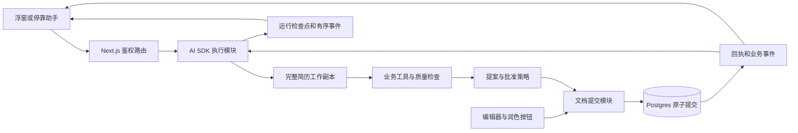

# Next.js 简历助手统一、可靠留痕与微服务退役规格

日期：2026-09-26。核查基线：`050d5bb5e`（当次核查与 `origin/main` 相同）。
状态：设计规格；实现、迁移、生产切流、归档移动和容器清理均未执行。

具体命令联合、SQL 原子写入约束、Run/attempt 转换及路由去向以[实施契约附录](2026-09-26-nextjs-agent-contracts.md)细化；两份文档须同批更新。

## 1. 已确认的方向与范围

用户明确决定：

1. AI 在线执行入口只保留 Next.js + Vercel AI SDK，全面退出独立 Agent 微服务及其部署路线。
2. 旧代码不能直接丢弃；从在线入口移出后归档，归档目录记录背景、内容、停用原因、复用和恢复条件。
3. 后续通过本机已有 SSH 凭证清理该项目相关服务容器；不能误伤同机其他业务。
4. 提示词必须改善建议空泛、表达生硬和缺少实质帮助的问题。
5. 本次交付详细方案与执行文档，不绑定具体执行模型。

这次只写设计文档和独立模拟 PoC。生产资源仅做只读盘点。实际清理安排在 Next.js 全能力替换并验证之后。

沿用现有产品行为以控制首期范围：以 `FloatingAgentChat` 的浮窗/停靠形态为现役入口，旧 AG-UI 面板归档；保留「直接修改 / 请求批准」两种模式和用户已保存的选择。直接模式仍须服从已授权的任务范围；诊断请求不得自动写简历，事实缺口不得靠编造填补。对破坏性操作增加明确确认。协作首期做兼容与冲突保护，不改造成全量字符级 CRDT 编辑器。

用户未要求无限后台任务。首期采用有界请求、持久化步骤检查点、显式继续；关闭页面或平台中断后可以恢复已完成工作，不能保证模型在页面关闭后持续运行。新建持久任务平台、队列、独立 worker 不在本次默认范围。

## 2. 当前问题和可核查证据

| 编号 | 事实 | 业务影响 | 本次处理 |
| --- | --- | --- | --- |
| F01 | 两套聊天执行链路：`apps/agent/src/http.ts` 与 Web `floating/chat/route.ts` | 工具、流、审批和存储分叉 | 保留 Next.js，迁移缺失能力，旧链路归档 |
| F02 | 已有简历首次初始化为空 Draft；读取为空、完整度 0；润色执行函数未注入 | 错诊、无效工具调用 | 以权威结构化简历建立统一工作副本；只注册可执行工具 |
| F03 | `experience.0.content` 等位置地址无旧值校验 | 提案生成后重排，会把 A 的建议写入 B；已内存复现 | 持久条目 ID + 修订号 + 字段前置条件 |
| F04 | 悬浮工具生成操作即返回 `applied: true` | 模型认为修改成功，但保存可能失败 | 生成提案与提交成功分开；成功由服务端回执决定 |
| F05 | 保存后异步创建版本 | 修改可能无历史、刷新后来源不完整 | 正文、修订、回执、业务事件原子写入 |
| F06 | Redis 记录与 Web 会话表未连通；批准信息主要拼成文字 | 不能可靠恢复或证明批准了哪版提案 | 持久 Run、事件、提案、决策、提交关联 |
| F07 | 工具事件迟发；事件消费等待 autosave；取消未贯通 | 卡顿、假状态、停止后继续消耗 | 分离流读取与提交；真实事件；取消和预算 |
| F08 | 上下文截断，固定 200k 预算展示；检查工具为启发式 | 遗漏内容、过度保证 | 结构化按需读取、真实预算、明确检查能力 |
| F09 | 版本按操作保存前快照；Diff 按下标；润色来源缺失 | 无法解释一次任务、错配 Diff、撤销误伤 | 任务分组、稳定 ID 对齐、完整来源、条件反向修改 |

内存复现只验证纯函数行为，没有请求真实模型/数据库。此次不把静态发现表述为生产事故频率。

额外事实：Web 用 Neon HTTP 或 postgres.js 两种驱动；当前 Neon HTTP `transaction()` 会直接抛错。根 `db:migrate` 是旧的一次性脚本，不能作为本方案通用迁移命令。生产真实入口是 `apps/web/scripts/migrate-on-deploy.ts` 和根 `vercel.json`。CI 当前已经运行 build，旧 AGENTS 文案说 CI 不构建的部分需在相关实现批次更正。

## 3. 成功标准

- 聊天、润色、整份诊断、模块建议均只调用 Web 内的 AI SDK 执行模块，不再依赖 Agent URL/JWT/Redis/SSH 部署。
- 同一工具读取「基准简历 + 本轮已暂存修改」，不会一部分读空 Draft、一部分读旧摘要。
- 只有持久提交回执可以驱动「已保存」；失败、冲突、等待用户都有独立状态。
- 任何新修改均能追到来源、实际前后值、所属任务和修订；重复请求不重复改文档。
- 旧简历、旧聊天和旧版本可以读取；旧提案不得在身份语义变化后盲目重放。
- 用户得到基于简历证据的具体建议；自然表达、任务相关、能落地，不强制套 STAR 标题。
- 退役后无活跃微服务入口/构建/工作流/自动拉起路线；归档内容完整可校验。
- 远端仅移除经核对的三个目标容器；共享网络、无关容器和保留数据不受影响。

## 4. 目标模块与边界



建议新增目录：

- `apps/web/lib/resume-mutations/`：命令校验、稳定身份、纯应用器、条件撤销、原子存储。所有写入口调用这里。
- `apps/web/lib/ai/`：provider 配置、运行模块、工作副本、工具、提示词、检查点和事件；服务端文件显式 `server-only`。
- `apps/web/lib/ai-client/`：单一事件 decoder/reducer、恢复与 UI 投影；禁止导入 provider 或数据库。
- `packages/shared/src/types/` 和 `schemas/`：浏览器/服务端共同使用的业务契约；不新增全局可变 store。

继续使用已安装的 `ai@6.0.204`、`@ai-sdk/openai-compatible@2.0.50`，不在同一轮升级 major。首期复用悬浮 UI；AI SDK `fullStream` 通过一个适配器转换为下文业务事件。无需为了此次迁移再引入 `useChat`、Hono、AG-UI 或新 provider 框架。保存模型消息中的 tool call/result，禁止续聊只保留 assistant/user 纯文本。

## 5. 文档身份、修订与提交契约

### 5.1 条目身份

为 experience、projects、education、research 条目增加持久 `id`，custom 已有 ID 保持不变。新条目创建时生成一次 ID；导入、复制、表单 append、Agent 新增均遵守相同规则。排序仅改变顺序，不能改变 ID。

旧文档继续走读侧兼容。owner 编辑入口在开始可写会话前，用一次 CAS 初始化缺失 ID 并持久化；并发初始化只能一个成功，另一个重新读取赢家。公开只读页不得写库。禁止 `.default(randomUUID)` 在每次 parse 时产生新身份。保留旧版本快照原文，旧版本身份无法可靠对应时显示旧式比较，不能按猜测执行单项撤销。

### 5.2 对外接口草案

```ts
type Target = {
  section: string;
  itemId?: string;        // 单例字段无 itemId
  field?: string;         // 白名单字段；不接受任意属性路径
};
type MutationCommand = {
  mutationId: string;     // 一次逻辑请求固定；超时重试不得换 ID
  resumeId: string;
  expectedRevision: number;
  operations: SemanticOperation[];
  changeSetId?: string;
  changeSetVersion?: number;
  decisionId?: string;
};
type CommitResult =
  | { status: 'committed'; mutationId: string; revision: number;
      versionId: string; changeSetId: string | null; operationIds: string[] }
  | { status: 'conflict'; currentRevision: number; targets: Target[] }
  | { status: 'rejected'; code: string };
```

`SemanticOperation` 为封闭判别联合：更新字段、插入条目、删除条目、重排条目、调整模块显示/顺序、更新样式/标题/模板。每种操作有专属 Zod schema；携带目标旧值哈希/完整旧值条件；删除携带整条目标条件；排序验证 ID 集合；更新 TipTap 必须校验允许的节点、marks、链接。actor、source、用户权限由服务器从调用入口确定，不接受模型伪造。

### 5.3 原子写入实现

先认证、读取当前文档、校验前置条件并纯函数计算新内容，再通过 **单条参数化 PostgreSQL 数据修改 CTE** 完成 CAS 更新、修订记录、回执、业务事件写入。Neon HTTP 与 postgres.js 都走 `db.execute`，不假装支持交互式 `db.transaction(callback)`。依赖链必须使用 `UPDATE ... RETURNING` 结果；更新 0 行时不能插入成功版本或事件。任一插入失败，整条 SQL 回滚。

约束：`UNIQUE(resumeId, mutationId)`、`UNIQUE(resumeId, revision)`；幂等记录包含规范化请求哈希。同一 mutationId 不同 payload 返回 409。同一次并发提交遇到 0 行，先在新语句重新读取幂等回执，区分「已经提交」与「冲突」；不能只依赖同语句 MVCC 快照看见其他事务的新回执。

首期严格文档 revision 冲突返回；前端保留本地未保存输入并提供重试/比较。后续在同一提交模块内对不相交目标做有条件 rebase，不允许客户端覆盖整份最新内容来解决冲突。

事务方案必须通过独立测试库故障注入与并发测试；mock SQL 调用不能证明事务正确。

### 5.4 存储

| 对象 | 主要字段与约束 |
| --- | --- |
| resume | 增加 revision，旧行从 0 起；content 保持最终正文 |
| resume_version | 复用旧表，新增可空 revision/fromRevision/changeSetId/runId/sourceDetail；新记录固定保存提交后的快照；旧记录标记 legacy 前快照，不篡改语义 |
| resume_mutation | mutationId、resumeId、actor、requestHash、operationIds、before/after、revision、receipt、source、undoOf；唯一幂等键 |
| resume_mutation_event | 文档提交 outbox，eventId、mutationId、runId(nullable)、payload；同正文事务写入，mutationId 唯一 |
| resume_change_set | 任务标题、baseRevision、proposalVersion、operations、状态、runId、summary；被批准后不能原地改内容 |
| resume_decision | changeSetId+proposalVersion、接受/拒绝操作 ID、actor、时间；绑定精确提案 |
| ai_run | userId、resumeId、sessionId、status、lease、checkpoint、cancelRequestedAt、promptVersion、model 标识、usage |
| ai_tool_execution | runId、attemptId、toolCallId、inputHash、status、result、proposalId、mutationId；完成结果在下一步模型调用前持久化 |
| ai_run_event | runId、attemptId、sequence、type、payload、sourceEventId、createdAt；唯一(runId, sequence)/sourceEventId；可重放 |

沿用 floating session/message 表作为聊天历史，新增格式版本和与 Run 的关联；兼容旧 parts。原 agent_session/event 表保留只读，首期不做破坏性删除或伪造缺失历史。

## 6. 执行、审批与恢复

### 6.1 生命周期

Run：`running → waiting_user | completed | failed | cancelled | interrupted`。
waiting_user/interrupted 可在新 attempt 中继续；completed/failed/cancelled 是任务最终终态，重试或重新生成要新建关联 Run。sequence 在同 Run 跨 attempts 单调增加。
提案：`draft → pending → partially_committed | committed | rejected | superseded`。
写入：`pending → committed | conflict | rejected`。模型 token 结束不能直接把写入标为成功。

每次启动只在服务器已认证且校验 owner 后分配 Run。user/resume/session 绑定必须一致；同一简历同一时刻只允许一个写 Run，使用数据库 lease 和递增 fencing token。超时接管前旧 token 作废；文档提交必须检查 Run 状态与 fencing token，避免僵尸请求晚到写入。用户在另一个标签页仍可编辑，冲突由 revision 拦截。

首期执行预算建议：路由 `maxDuration=60`，内部 deadline 45 秒，单模型请求最多 30 秒，最多 6 个模型步骤；发布前按实际平台套餐校验并可统一调整。开始后即发送 run.started。时间不足时持久检查点、标 interrupted，允许继续；不假称完成。`after()` 仅用于非关键日志清理，不能承担唯一检查点或无限后台任务。

### 6.2 工具执行策略

- 读取工作副本：完整结构化简历来自 owner 校验后的数据库；启动前先 flush 本地编辑并确认 revision。针对字段按需读，不再按 12k 固定顺序截断后声称全量可见。
- 暂存修改工具返回 proposed、changeSetId、目标及实际差异；草稿立即更新，让下一次读取看见本轮建议。
- 直接模式：明确修改请求范围内的低风险操作可提交；收到持久回执后将已提交内容提升为工作副本基准。
- 批准模式：把同一任务的修改聚合后停在 waiting_user；批准是持久决策，带提案版本。按操作依赖分组，允许独立组部分接受。
- 事实不足：调用 askUser，结构化问题和回答入库；用户拒绝某提案后不能再次提交同一版或换 ID 重提。
- 失败工具返回类型化结果；不允许把所有工具硬编码成 completed。
- 删除、清空正文、覆盖用户已修改字段必须确认或返回冲突。模型不能改变授权模式。

### 6.3 流和检查点

事件 envelope：`{schemaVersion: 1, eventId, runId, attemptId, sequence, type, occurredAt, payload}`。
类型：run.started、attempt.started、text.delta、tool.started、tool.arguments、tool.succeeded、tool.failed、proposal.ready、decision.recorded、mutation.committed、mutation.conflict、run.waiting_user、run.interrupted、run.completed、run.failed、run.cancelled。

业务事件先持久再发送；text delta 可按 50–100ms/大小批量持久，保证 sequence 只覆盖已持久批次，未持久尾部允许丢失但不代表正文丢失。mutation.committed 的可靠源写在与正文同一 CTE 的 resume_mutation_event；ai_run_event 是其去重投影，投影失败时下一次读取/恢复先补齐，不把已提交正文报成失败。每个 attempt 只有一个结束结果，Run 最终终态只能一次；缺少结束事件的 EOF 展示中断。

保持一个执行连接；恢复 GET 只读事件和检查点，不偷偷启动第二次模型调用。新 run/continue 请求都需幂等键。取消写入数据库状态并中止当前请求；跨实例用共享取消标记，步间和每次提交前检查。平台硬杀后按 lease 过期识别 interrupted，不自动重放已提交工具。

BYOK key 仅请求内存与浏览器当前 session 使用；不写会话/检查点/归档/日志。继续时需重新携带 key；浏览器会话丢失时提示重新连接模型。服务端默认 provider 若仍需要，从 Web 独立环境配置读取，不依赖待销毁的微服务环境文件。

## 7. 留痕、Diff 与协作

- 一次用户任务对应 changeSet；每个提交有自身 revision，历史 UI 聚合为一个任务，可展开具体提交。
- 历史同时记录手动输入、Agent、润色、恢复、模板/样式调整；旧来源不可追溯时标「旧版记录」，不要生成虚构 actor 或 runId。
- Diff 按条目 ID 对齐；分开显示插入、删除、移动、字段修改、TipTap marks、模块显示/顺序、样式、模板与标题变化。
- 「撤销本次修改」创建新的反向 mutation，只允许当前目标仍等于该次 after 值的操作撤销；同字段后来被改则冲突，其他字段保留。
- 「恢复历史版本」基于当前 revision 提交一次全量 restore，并保留恢复前后快照。不能直接覆盖 DB。
- 编辑器按字段维护未提交输入；服务端回执只确认对应 generation，不能 `form.reset` 擦除后来输入。
- 现有 PartyKit/Yjs 保留。首期记录来源为协作时，只有服务端可核验的身份才称具体协作者；现有 owner 代保存若没有签名证明，显示「协作同步，保存者为所有者」，不伪造导师身份。
- 无法可靠归因的协作会话内，首期 Agent 只给提案，实际提交需退出协作或显式确认最新基准；这比把整块 Y.Map 更新误当成可独立撤销的字符事务更可靠。

## 8. 建议质量和提示词

详见同族提示词方案。系统提示分为角色与任务、事实规则、工具能力、输出适配四块；最近用户约束结构化保存。按意图诊断、改写、岗位匹配、补事实，不能强制每轮全套检查。

有效建议最小单元：具体位置 + 观察到的原文证据 + 对目标岗位的影响 + 可以采取的动作。已有足够事实时直接给可用改写；缺少数字时提升信息组织、责任范围、方法细节，不捏造指标；必要时只问一个高价值问题。

提示词不能替代提交一致性、权限、事实校验或布局测量。事实检查输出 matched/unsupported/needs_confirmation；版式检查使用当前模板实际测量，只有字符估算时明确标「估算」。

## 9. 归档与切流

归档根：`archive/agent-microservice/2026-09-26/`，本次只创建说明，实际内容在归档切片填入。

必须先完成：聊天工具、润色、诊断、模块建议、模型连接、会话历史、错误与取消全部 Web 化。不能只切 floating/chat 就关闭服务。

归档保留服务端源码/测试/fixtures/Dockerfile/Compose/Caddy、旧部署 workflow、Web AG-UI 入口与旧桥接实现、历史依赖锁文件与迁移前配置、有关架构文档。使用固定基线逐文件 manifest + SHA-256，保留目录对应关系。禁止归档真实 `.env`、私钥、数据库导出、简历或密钥；示例环境文件可保留。

归档完成后在线目录不得 import 归档；pnpm workspace、递归构建、测试发现、CI affected-apps、Docker context 都不能再把归档当现役应用。现役 docs/agent 和 AGENTS 更新为 Next.js 事实。旧决策原文保留，通过新 proposed Note 互链，落地后按 notes 归档工具封存旧决策。

## 10. 线上盘点与退役约束

2026-09-26 SSH 只读核查：本机 alias `ucloud-memos` 可连接文档所述主机；Compose 项目 `agent`，工作目录 `/opt/intro-agent/apps/agent`；容器 `agent-agent-1`、`agent-redis-1`、`agent-caddy-1` 在运行。GitHub `Deploy Agent` workflow ID `290746404` 仍 active。

**共享网络发现：`agent_default` 还连接多个无关业务。禁止 `docker compose down`、network rm、system prune 或按名称含 agent 批量删除。** 三个目标容器必须逐个核验 project/service/workdir/image/mounts；仅停用并移除这些容器，网络和卷保留。

退役顺序：新版本验证 → 阻断旧自动部署并排空任务 → 导出所需旧会话至受控存储/确认保留卷 → 记录镜像 digest 和恢复条件 → 精确停止移除目标容器 → 验证其他容器与新业务 → 清除专属路由/变量/密钥引用 → 完成记录。共享域名、主机 Docker、同机其他 Agent/Redis 都不在清理范围。

Vercel 项目套餐、实际生产 provider 配置、DNS 管理权限以及旧 Redis 数据导出尚未核实，属于发布前证据项；凭据缺失不能用删除服务来「验证」。

## 11. PoC、测试与发布约束

PoC：[单页交互模拟](../pocs/2026-09-26-nextjs-agent-workspace.html)。只用于验证提案/保存/冲突/撤销状态表达，不声称验证事务、真实模型效果或生产布局。

测试面预定为文档命令接口、Run 启停/事件接口、实际工具注册、历史恢复接口和用户可见 UI；重点验证公开行为。实现每个行为先红后绿，不批量写与内部实现同构的测试。事务与并发必须真实隔离数据库验证。

所有实施切片都跑仓库 DoD：test、typecheck、lint、build、notes:verify。本次文档交付只做文档门禁、链接/计划完整性及 PoC 状态检查，不声称业务门禁已跑。

## 12. 参考与适用边界

- [Vercel 函数限制](https://vercel.com/docs/functions/limitations)：流式响应也受函数时限约束；实际套餐发布前复核。
- [AI SDK 工具调用](https://ai-sdk.dev/docs/ai-sdk-core/tools-and-tool-calling)：工具及批准机制；实施以已安装 v6 类型定义为准，不套用最新 major 示例。
- [AI SDK 停止流](https://ai-sdk.dev/docs/advanced/stopping-streams)：取消信号须贯通模型调用。
- [Drizzle Neon 驱动](https://orm.drizzle.team/docs/connect-neon)：HTTP 与交互事务能力不同，本地安装源码已验证限制。
- 本地 Next.js 指南：`node_modules/next/dist/docs/01-app/01-getting-started/15-route-handlers.md` 和 `03-api-reference/04-functions/after.md`。
